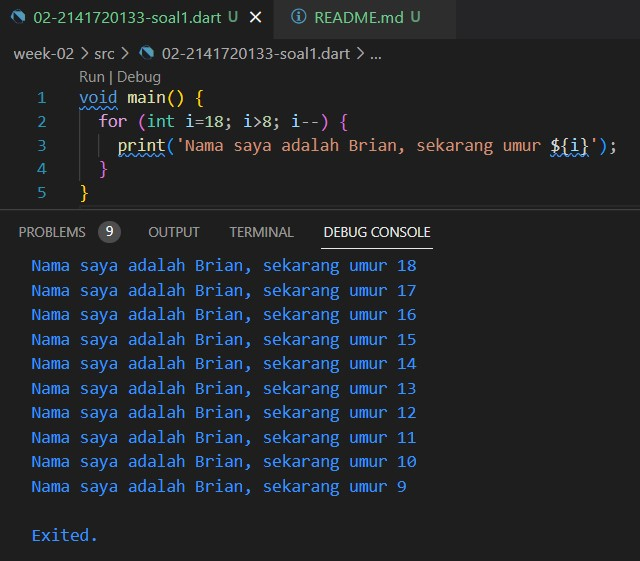

# Tugas Praktikum

### Nama : Brian Mohamad Safiudin
### NIM : 2141720133
### Kelas : TI-3F

## Soal 1
#### Modifikasilah kode pada baris 3 di VS Code atau Editor Code favorit Anda berikut ini agar mendapatkan keluaran (output) sesuai yang diminta!

## Soal 2
#### Mengapa sangat penting untuk memahami bahasa pemrograman Dart sebelum kita menggunakan framework Flutter ? Jelaskan!
###### karena Dart adalah bahasa pemrograman yang digunakan secara eksklusif untuk mengembangkan aplikasi menggunakan Flutter. Dart memiliki sintaksis dan paradigma pemrograman yang berbeda dari bahasa-bahasa pemrograman lain seperti JavaScript, Python, atau Java. Memahami sintaksis Dart, tipe data, operator, dan konsep dasarnya adalah langkah awal yang penting dalam menguasai Flutter.

## Soal 3
#### Rangkumlah materi dari codelab ini menjadi poin-poin penting yang dapat Anda gunakan untuk membantu proses pengembangan aplikasi mobile menggunakan framework Flutter.

#### Dart bertujuan untuk menggabungkan kelebihan-kelebihan dari sebagian besar bahasa tingkat tinggi dengan fitur-fitur bahasa pemrograman terkini, antara lain sebagai berikut:

###### Productive tooling: merupakan fitur kakas (tool) untuk menganalisis kode, plugin IDE, dan ekosistem paket yang besar.
###### Garbage collection: untuk mengelola atau menangani dealokasi memori (terutama memori yang ditempati oleh objek yang tidak lagi digunakan).
###### Type annotations (opsional): untuk keamanan dan konsistensi dalam mengontrol semua data dalam aplikasi.
###### Statically typed: Meskipun type annotations bersifat opsional, Dart tetap aman karena menggunakan fitur type-safe dan type inference untuk menganalisis types saat runtime. Fitur ini penting untuk menemukan bug selama kompilasi kode.
###### Portability: bahasa Dart tidak hanya untuk web (yang dapat diterjemahkan ke JavaScript) tetapi juga dapat dikompilasi secara native ke kode Advanced RISC Machines (ARM) dan x86.

#### Kode Dart dapat dieksekusi pada lingkungan yang mendukung bahasa Dart. Lingkungan yang mendukung bahasa Dart perlu memperhatikan fitur-fitur penting seperti berikut:

###### Runtime systems
###### Dart core libraries
###### Garbage collectors

#### Dart hadir dengan banyak operator typical yang bekerja seperti banyak bahasa pemrograman lainnya; yaitu sebagai berikut:

###### + untuk tambahan.
###### - untuk pengurangan.
###### * untuk perkalian.
###### / untuk pembagian.
###### ~/ untuk pembagian bilangan bulat. Di Dart, setiap pembagian sederhana dengan / menghasilkan nilai double. Untuk mendapatkan nilai bilangan bulat, Anda perlu membuat semacam transformasi (yaitu, typecast) dalam bahasa pemrograman lain; namun Dart sudah mendukung untuk operasi ini.
###### % untuk operasi modulus (sisa bagi dari bilangan bulat).
###### -expression untuk negasi (yang membalikkan suatu nilai).

## Soal 4 (Google Slide)
#### Buatlah slide yang berisi penjelasan dan contoh eksekusi kode tentang perbedaan Null Safety dan Late variabel ! (Khusus soal ini kelompok berupa link google slide)
###### https://docs.google.com/presentation/d/1oT5K4ch9DpX5ZJk8b1gcoet2ImcXjlNnlQtmsWTuLCk/edit?usp=sharing

