# Tugas Praktikum Pertemuan 4

### Nama : Brian Mohamad Safiudin
### NIM : 2141720133
### Kelas : TI-3F

# Praktikum 1: Eksperimen Tipe Data List

## Langkah 1
#### Ketik atau salin kode program berikut ke dalam fungsi main().
###### var list = [1, 2, 3];
###### assert(list.length == 3);
###### assert(list[1] == 2);
###### print(list.length);
###### print(list[1]);

###### list[1] = 1;
###### assert(list[1] == 1);
###### print(list[1]);

## Langkah 2
#### Silakan coba eksekusi (Run) kode pada langkah 1 tersebut. Apa yang terjadi? Jelaskan!
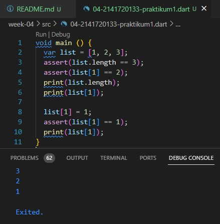
###### Kode diatas membuat list dengan tiga elemen (1, 2, dan 3) dan memeriksa panjang list serta nilai elemen ke-2. Kemudian, program mencetak panjang list dan nilai elemen ke-2. Setelah itu, nilai elemen ke-2 diubah menjadi 1 dan diperiksa kembali untuk memastikan perubahan. Hasil keluaran yang diharapkan adalah panjang list (3), nilai awal elemen ke-2 (2), dan nilai elemen ke-2 setelah diubah (1). Pernyataan assert digunakan untuk memastikan bahwa kondisi yang diberikan benar selama eksekusi program.

## Langkah 3
#### Ubah kode pada langkah 1 menjadi variabel final yang mempunyai index = 5 dengan default value = null. Isilah nama dan NIM Anda pada elemen index ke-1 dan ke-2. Lalu print dan capture hasilnya. Apa yang terjadi ? Jika terjadi error, silakan perbaiki.
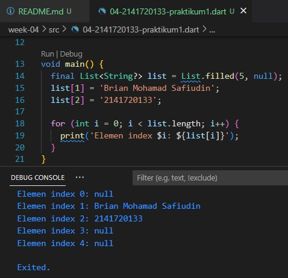
###### Kode diatas membuat variabel list yang bersifat final, memiliki panjang 5, dan elemen default adalah null, kemudian mengisi elemen index 1 dan 2 dengan nama dan NIM, dan mencetak hasilnya

# Praktikum 2: Eksperimen Tipe Data Set

## Langkah 1
#### Ketik atau salin kode program berikut ke dalam fungsi main().
###### var halogens = {'fluorine', 'chlorine', 'bromine', 'iodine', 'astatine'};
###### print(halogens);

## Langkah 2
#### Silakan coba eksekusi (Run) kode pada langkah 1 tersebut. Apa yang terjadi? Jelaskan! Lalu perbaiki jika terjadi error.
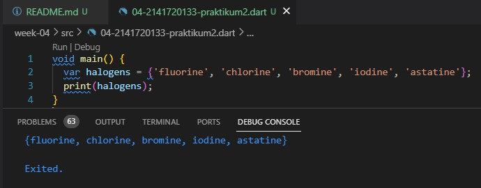
###### Kode diatas error merupakan penggunaan variabel dan array (atau daftar) dalam beberapa bahasa pemrograman yang berbeda. Kode tersebut membuat sebuah daftar (list) yang berisi elemen-elemen yang mewakili unsur-unsur halogen dalam tabel periodik.

## Langkah 3
#### Tambahkan kode program berikut, lalu coba eksekusi (Run) kode Anda. Apa yang terjadi ? Jika terjadi error, silakan perbaiki namun tetap menggunakan ketiga variabel tersebut. Tambahkan elemen nama dan NIM Anda pada kedua variabel Set tersebut dengan dua fungsi berbeda yaitu .add() dan .addAll(). Untuk variabel Map dihapus, nanti kita coba di praktikum selanjutnya.
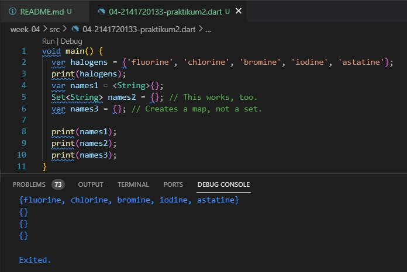
###### Kode diatas mencoba mendefinisikan tiga variabel yang berbeda untuk menyimpan data koleksi, namun memiliki hasil yang berbeda. Variabel names1 dan names2 berhasil mendefinisikan set kosong yang berisi elemen bertipe String, tetapi names3 sebenarnya membuat sebuah map (kumpulan pasangan kunci-nilai) kosong, bukan sebuah set, karena Dart tidak dapat secara otomatis menentukan tipe dari {}

#### Tambahkan elemen nama dan NIM Anda pada kedua variabel Set tersebut dengan dua fungsi berbeda yaitu .add() dan .addAll(). Untuk variabel Map dihapus, nanti kita coba di praktikum selanjutnya.
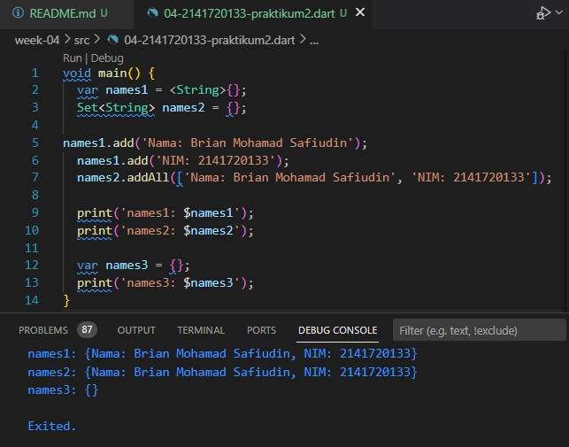

# Praktikum 3: Eksperimen Tipe Data Maps

## Langkah 1
#### Ketik atau salin kode program berikut ke dalam fungsi main().
###### var gifts = {
######   // Key:    Value
######   'first': 'partridge',
######   'second': 'turtledoves',
######   'fifth': 1
###### };

###### var nobleGases = {
######   2: 'helium',
######   10: 'neon',
######   18: 2,
###### };

###### print(gifts);
###### print(nobleGases);

## Langkah 2
#### Silakan coba eksekusi (Run) kode pada langkah 1 tersebut. Apa yang terjadi? Jelaskan! Lalu perbaiki jika terjadi error.
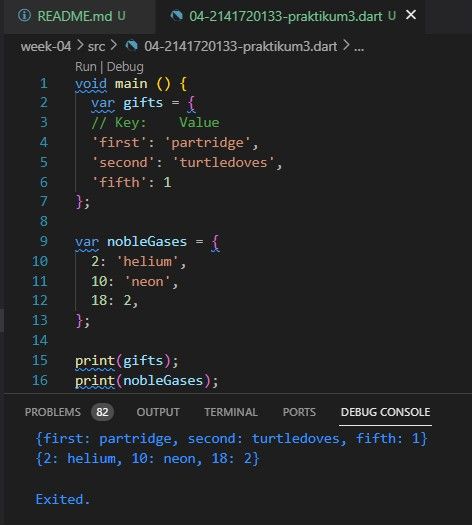
###### Kode diatas menggunakan map dalam bahasa pemrograman Dart, yang memungkinkan penyimpanan pasangan kunci-nilai. Dua map, yaitu 'gifts' dan 'nobleGases', dibuat dengan berbagai jenis nilai sebagai elemen. 'gifts' memiliki kunci berupa string ('first', 'second', 'fifth') dan nilai yang beragam, termasuk string dan integer, sementara 'nobleGases' memiliki kunci berupa bilangan bulat dan nilai yang juga beragam. Map ini digunakan untuk mengorganisir dan mengakses data dengan cara yang terstruktur, dan hasilnya dicetak ke konsol untuk ditampilkan.

## Langkah 3
#### Tambahkan kode program berikut, lalu coba eksekusi (Run) kode Anda. Apa yang terjadi ? Jika terjadi error, silakan perbaiki.
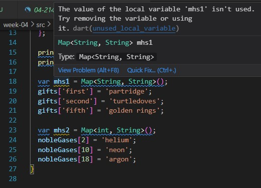
###### Kode di atas memiliki beberapa kesalahan:

###### Variabel mhs1 dan mhs2 dideklarasikan sebagai map baru, tetapi dalam kode selanjutnya, mencoba untuk mengakses dan mengubah nilai di dalam gifts dan nobleGases. Seharusnya menggunakan gifts dan nobleGases yang sudah dideklarasikan sebelumnya, bukan variabel mhs1 dan mhs2.

###### Pada bagian gifts, mencoba untuk mengubah nilai kunci 'first' dari 'partridge' menjadi 'golden rings', tetapi perlu menggunakan variabel gifts untuk melakukan ini, bukan mhs1.

###### Pada bagian nobleGases, mencoba untuk mengubah nilai dengan kunci 18 menjadi 'argon', tetapi Anda perlu menggunakan variabel nobleGases juga di sini, bukan mhs2.

#### Kode yang sudah diperbaiki
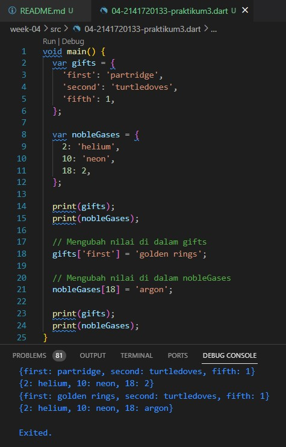

#### Tambahkan elemen nama dan NIM Anda pada tiap variabel di atas (gifts, nobleGases, mhs1, dan mhs2). Dokumentasikan hasilnya dan buat laporannya!
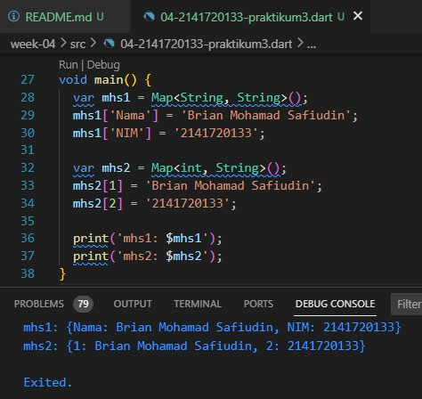

# Praktikum 4: Eksperimen Tipe Data List: Spread dan Control-flow Operators

## Langkah 1
#### Ketik atau salin kode program berikut ke dalam fungsi main().
###### var list = [1, 2, 3];
###### var list2 = [0, ...list];
###### print(list1);
###### print(list2);
###### print(list2.length);

## Langkah 2
#### Silakan coba eksekusi (Run) kode pada langkah 1 tersebut. Apa yang terjadi? Jelaskan! Lalu perbaiki jika terjadi error.
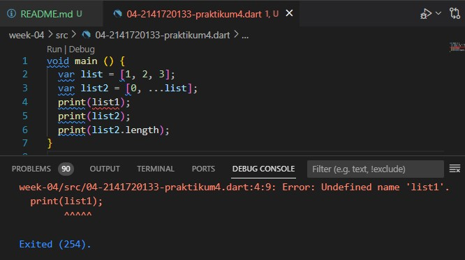
###### Kode diatas error karena dalam pernyataan print, mencoba untuk mencetak variabel list1 yang sebenarnya tidak dideklarasikan.

#### Kode yang sudah diperbaiki
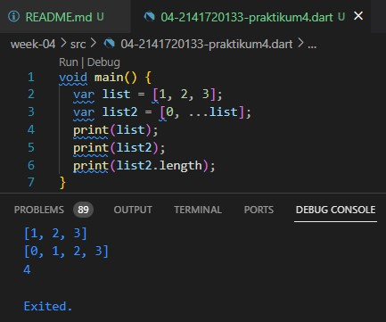

## Langkah 3
#### Tambahkan kode program berikut, lalu coba eksekusi (Run) kode Anda.
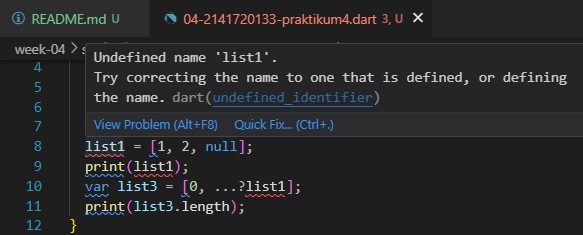
###### Kode diatas error karena list1 tidak didefine / inisialisasi tipe datanya.

#### Kode yang sudah diperbaiki
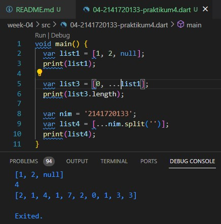

## Langkah 4
#### Tambahkan kode program berikut, lalu coba eksekusi (Run) kode Anda. Apa yang terjadi ? Jika terjadi error, silakan perbaiki. Tunjukkan hasilnya jika variabel promoActive ketika true dan false.
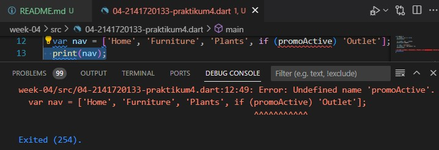
###### Kode diatas error karena Nama 'promoAktif' berupa boolean dan tidak ditentukan valuenya.

#### Kode yang sudah diperbaiki
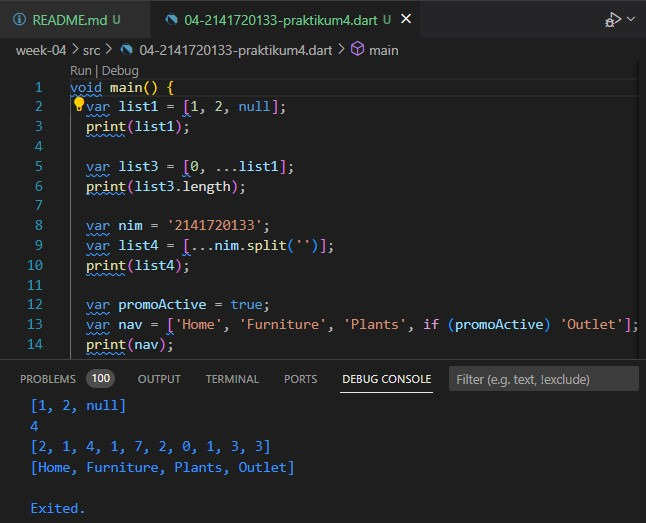

## Langkah 5
#### Tambahkan kode program berikut, lalu coba eksekusi (Run) kode Anda. Apa yang terjadi ? Jika terjadi error, silakan perbaiki. Tunjukkan hasilnya jika variabel login mempunyai kondisi lain.
###### var nav2 = ['Home', 'Furniture', 'Plants', if (login case 'Manager') 'Inventory'];
###### print(nav2);

###### Kode diatas error karena 'login' tidak ter-define / kondisi yang salah.

#### Kode yang sudah diperbaiki
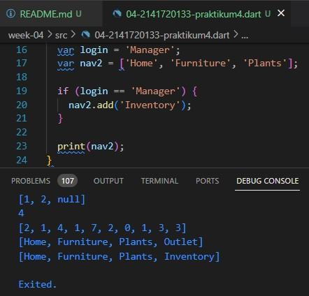

## Langkah 6
#### Tambahkan kode program berikut, lalu coba eksekusi (Run) kode Anda. Apa yang terjadi ? Jika terjadi error, silakan perbaiki. Tunjukkan hasilnya jika variabel promoActive ketika true dan false.

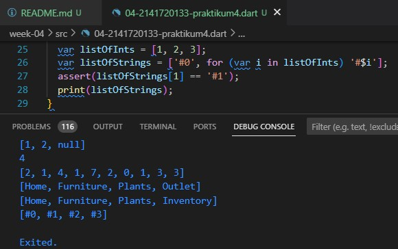

###### Kode diatas menggunakan ekspresi koleksi (for) untuk membuat list baru listOfStrings berdasarkan nilai dari listOfInts

####  Manfaat Collection For
###### Adalah memungkinkan untuk membuat list baru atau mengubah list yang sudah ada secara efisien berdasarkan data yang ada dalam list lainnya.

# Praktikum 5: Eksperimen Tipe Data Records

## Langkah 1
#### Ketik atau salin kode program berikut ke dalam fungsi main().
###### var record = ('first', a: 2, b: true, 'last');
###### print(record)

## Langkah 2
#### Silakan coba eksekusi (Run) kode pada langkah 1 tersebut. Apa yang terjadi? Jelaskan! Lalu perbaiki jika terjadi error.
###### Kode diatas error karena tidak diberi ";" diakhir kode program
#### Kode yang sudah diperbaiki
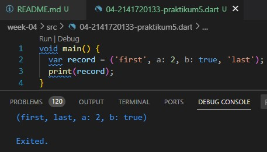

## Langkah 3
#### Tambahkan kode program berikut di luar scope void main(), lalu coba eksekusi (Run) kode Anda.
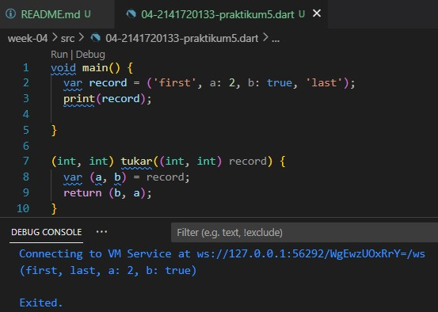

###### Fungsi tukar() pada kode diatas harus dipanggil dari dalam main() agar dapat dieksekusi. Karena fungsi tukar() tidak dipanggil, maka tidak akan dieksekusi.

#### Kode yang sudah diperbaiki
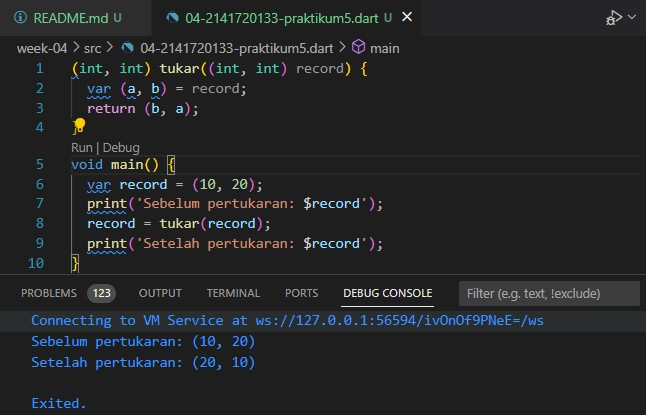

## Langkah 4
#### Tambahkan kode program berikut di luar scope void main(), lalu coba eksekusi (Run) kode Anda. Apa yang terjadi ? Jika terjadi error, silakan perbaiki. Inisialisasi field nama dan NIM Anda pada variabel record mahasiswa di atas. Dokumentasikan hasilnya dan buat laporannya!
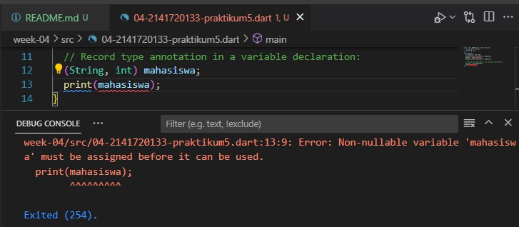

###### Kode diatas error karena variabel 'mahasiswa' non-nullable harus ditetapkan sebelum dapat digunakan.

#### Kode yang sudah diperbaiki
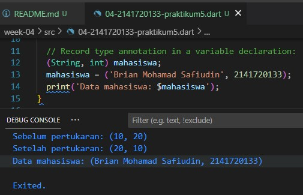

## Langkah 5
#### Tambahkan kode program berikut di dalam scope void main(), lalu coba eksekusi (Run) kode Anda. Apa yang terjadi ? Jika terjadi error, silakan perbaiki. Gantilah salah satu isi record dengan nama dan NIM Anda, lalu dokumentasikan hasilnya dan buat laporannya!

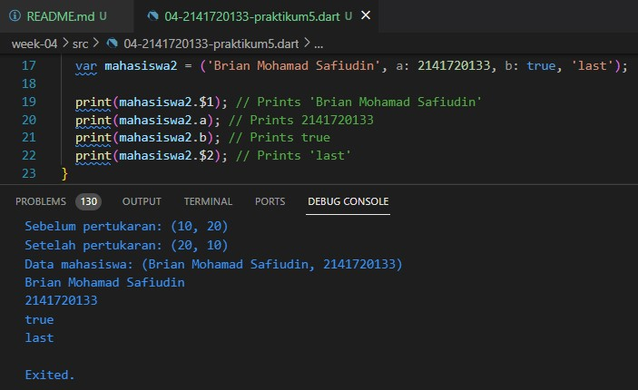

###### Kode diatas merupakan penggunaan tuple (pasangan nilai) dengan penamaan field yang dapat diakses menggunakan sintaks $. Kode tersebut membuat sebuah tuple yang berisi nama dan NIM, kemudian mencetaknya ke konsol.

# Tugas Praktikum
#### 1. Silakan selesaikan Praktikum 1 sampai 3, lalu dokumentasikan berupa screenshot hasil pekerjaan beserta penjelasannya!
###### Selesai

#### 2. Buatlah sebuah program yang dapat menampilkan bilangan prima dari angka 0 sampai 201 menggunakan Dart. Ketika bilangan prima ditemukan, maka tampilkan nama lengkap dan NIM Anda.
## Program bilangan prima 0 sampai 201

#### 3. Kumpulkan berupa link commit repo GitHub pada tautan yang telah disediakan di grup Telegram!
###### Selesai
