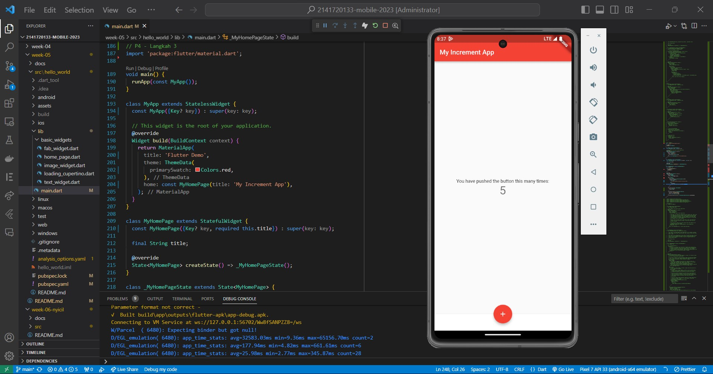
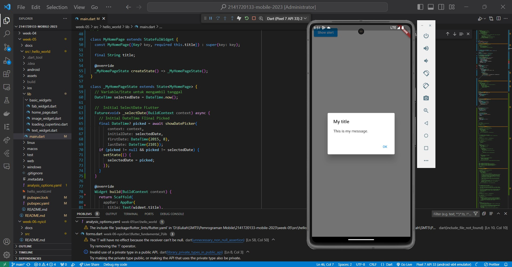
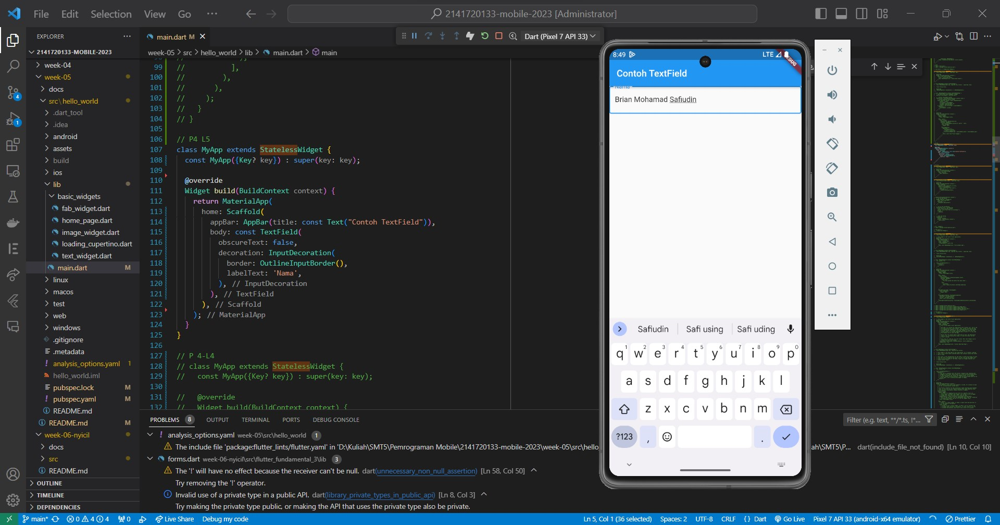
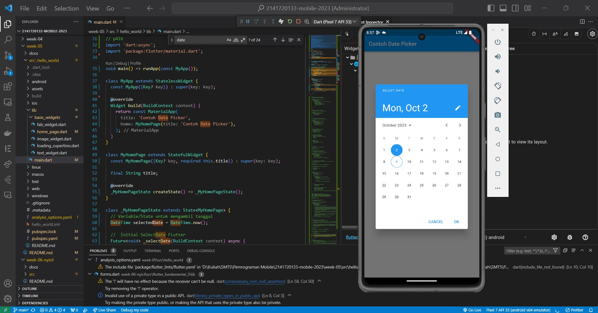

# Tugas Praktikum Pertemuan 5

### Nama : Brian Mohamad Safiudin
### NIM : 2141720133
### Kelas : TI-3F

# Praktikum 1: Membuat Project Flutter Baru

## Langkah 1
#### Buka VS Code, lalu tekan tombol Ctrl + Shift + P maka akan tampil Command Palette, lalu ketik Flutter. Pilih New Application Project.


## Langkah 2
#### Kemudian buat folder sesuai style laporan praktikum yang Anda pilih. Disarankan pada folder dokumen atau desktop atau alamat folder lain yang tidak terlalu dalam atau panjang. Lalu pilih Select a folder to create the project in.


## Langkah 3
#### Buat nama project flutter hello_world seperti berikut, lalu tekan Enter. Tunggu hingga proses pembuatan project baru selesai.


## Langkah 4
#### Jika sudah selesai proses pembuatan project baru, pastikan tampilan seperti berikut. Pesan akan tampil berupa "Your Flutter Project is ready!" artinya Anda telah berhasil membuat project Flutter baru.


# Praktikum 2: Membuat Repository GitHub dan Laporan Praktikum

## Langkah 1 - 10
#### Lakukan push juga untuk semua file lainnya dengan pilih Stage All Changes. Beri pesan commit "project hello_world". Maka akan tampil di repository GitHub Anda seperti berikut.


## Langkah 11
#### Kembali ke VS Code, ubah platform di pojok kanan bawah ke emulator atau device atau bisa juga menggunakan browser Chrome. Lalu coba running project hello_world dengan tekan F5 atau Run > Start Debugging. Tunggu proses kompilasi hingga selesai, maka aplikasi flutter pertama Anda akan tampil seperti berikut.


## Langkah 12
#### Silakan screenshot seperti pada Langkah 11, namun teks yang ditampilkan dalam aplikasi berupa nama lengkap Anda. Simpan file screenshot dengan nama 01.png pada folder images (buat folder baru jika belum ada) di project hello_world Anda. Lalu ubah isi README.md seperti berikut, sehingga tampil hasil screenshot pada file README.md. Kemudian push ke repository Anda.


# Praktikum 3: Menerapkan Widget Dasar

## Langkah 1
#### Buat folder baru basic_widgets di dalam folder lib. Kemudian buat file baru di dalam basic_widgets dengan nama text_widget.dart. Ketik atau salin kode program berikut ke project hello_world Anda pada file text_widget.dart. tampil di repository GitHub Anda seperti berikut.
#### Lakukan import file text_widget.dart ke main.dart, lalu ganti bagian text widget dengan kode di atas. Maka hasilnya seperti gambar berikut. Screenshot hasil milik Anda, lalu dibuat laporan pada file README.md.


## Langkah 2
#### Buat sebuah file image_widget.dart di dalam folder basic_widgets dengan isi kode berikut.
#### Lakukan penyesuaian asset pada file pubspec.yaml dan tambahkan file logo Anda di folder assets project hello_world.
#### Jangan lupa sesuaikan kode dan import di file main.dart kemudian akan tampil gambar seperti berikut.


# Praktikum 4: Menerapkan Widget Material Design dan iOS Cupertino

## Langkah 1
#### Cupertino Button dan Loading Barfungsi main().
###### Buat file di basic_widgets > loading_cupertino.dart. Import stateless widget dari material dan cupertino. Lalu isi kode di dalam method Widget build adalah sebagai berikut.
```dart
return MaterialApp(
      home: Container(
        margin: const EdgeInsets.only(top: 30),
        color: Colors.white,
        child: Column(
          children: <Widget>[
            CupertinoButton(
              child: const Text("Contoh button"),
              onPressed: () {},
            ),
            const CupertinoActivityIndicator(),
          ],
        ),
      ),
    );
```


## Langkah 2
#### Button widget terdapat beberapa macam pada flutter yaitu ButtonBar, DropdownButton, TextButton, FloatingActionButton, IconButton, OutlineButton, PopupMenuButton, dan ElevatedButton.
#### Buat file di basic_widgets > fab_widget.dart. Import stateless widget dari material. Lalu isi kode di dalam method Widget build adalah sebagai berikut.
```dart
return MaterialApp(
      home: Scaffold(
        floatingActionButton: FloatingActionButton(
          onPressed: () {
            // Add your onPressed code here!
          },
          child: const Icon(Icons.thumb_up),
          backgroundColor: Colors.pink,
        ),
      ),
    );
```


## Langkah 3
#### Scaffold widget digunakan untuk mengatur tata letak sesuai dengan material design. Ubah isi kode main.dart seperti berikut.
```dart
import 'package:flutter/material.dart';

void main() {
  runApp(const MyApp());
}

class MyApp extends StatelessWidget {
  const MyApp({Key? key}) : super(key: key);

  // This widget is the root of your application.
  @override
  Widget build(BuildContext context) {
    return MaterialApp(
      title: 'Flutter Demo',
      theme: ThemeData(
        primarySwatch: Colors.red,
      ),
      home: const MyHomePage(title: 'My Increment App'),
    );
  }
}

class MyHomePage extends StatefulWidget {
  const MyHomePage({Key? key, required this.title}) : super(key: key);

  final String title;

  @override
  State<MyHomePage> createState() => _MyHomePageState();
}

class _MyHomePageState extends State<MyHomePage> {
  int _counter = 0;

  void _incrementCounter() {
    setState(() {
      _counter++;
    });
  }

  @override
  Widget build(BuildContext context) {
    return Scaffold(
      appBar: AppBar(
        title: Text(widget.title),
      ),
      body: Center(
        child: Column(
          mainAxisAlignment: MainAxisAlignment.center,
          children: <Widget>[
            const Text(
              'You have pushed the button this many times:',
            ),
            Text(
              '$_counter',
              style: Theme.of(context).textTheme.headline4,
            ),
          ],
        ),
      ),
      bottomNavigationBar: BottomAppBar(
        child: Container(
          height: 50.0,
        ),
      ),
      floatingActionButton: FloatingActionButton(
        onPressed: _incrementCounter,
        tooltip: 'Increment Counter',
        child: const Icon(Icons.add),
      ), 
      floatingActionButtonLocation: FloatingActionButtonLocation.centerDocked,
    );
  }
}
```


## Langkah 4
#### Dialog widget pada flutter memiliki dua jenis dialog yaitu AlertDialog dan SimpleDialog. Ubah isi kode main.dart seperti berikut.
```dart
class MyApp extends StatelessWidget {
  const MyApp({Key? key}) : super(key: key);

  @override
  Widget build(BuildContext context) {
    return const MaterialApp(
      home: Scaffold(
        body: MyLayout(),
      ),
    );
  }
}

class MyLayout extends StatelessWidget {
  const MyLayout({Key? key}) : super(key: key);

  @override
  Widget build(BuildContext context) {
    return Padding(
      padding: const EdgeInsets.all(8.0),
      child: ElevatedButton(
        child: const Text('Show alert'),
        onPressed: () {
          showAlertDialog(context);
        },
      ),
    );
  }
}

showAlertDialog(BuildContext context) {
  // set up the button
  Widget okButton = TextButton(
    child: const Text("OK"),
    onPressed: () {
      Navigator.pop(context);
    },
  );

  // set up the AlertDialog
  AlertDialog alert = AlertDialog(
    title: const Text("My title"),
    content: const Text("This is my message."),
    actions: [
      okButton,
    ],
  );

  // show the dialog
  showDialog(
    context: context,
    builder: (BuildContext context) {
      return alert;
    },
  );
}
```


## Langkah 5
#### Flutter menyediakan widget yang dapat menerima input dari pengguna aplikasi yaitu antara lain Checkbox, Date and Time Pickers, Radio Button, Slider, Switch, TextField.


## Langkah 6
#### Date and Time Pickers termasuk pada kategori input dan selection widget, berikut adalah contoh penggunaan Date and Time Pickers.


# Tugas Praktikum
#### 1. Selesaikan Praktikum 1 sampai 4, lalu dokumentasikan dan push ke repository Anda berupa screenshot setiap hasil pekerjaan beserta penjelasannya di file README.md!
###### Selesai

#### 2. Pada praktikum 4 mulai dari Langkah 3 sampai 6, buatlah file widget tersendiri di folder basic_widgets, kemudian pada file main.dart cukup melakukan import widget sesuai masing-masing langkah tersebut!
###### Selesai

#### 3. Selesaikan Codelabs: Your first Flutter app, lalu buatlah laporan praktikumnya dan push ke repository GitHub Anda!
###### Selesai

#### 4. README.md berisi: capture hasil akhir tiap praktikum (side-by-side, bisa juga berupa file GIF agar terlihat proses perubahan ketika ada aksi dari pengguna) di browser dan perangkat fisik (device) dengan menampilkan NIM dan Nama Anda sebagai ciri pekerjaan Anda. Jika mode developer di perangkat HP Anda belum aktif, silakan cari di internet cara mengaktifkannya!
###### Selesai

#### 5. Kumpulkan berupa link repository/commit GitHub Anda ke tautan spreadsheet yang telah disepakati oleh dosen!
###### Selesai