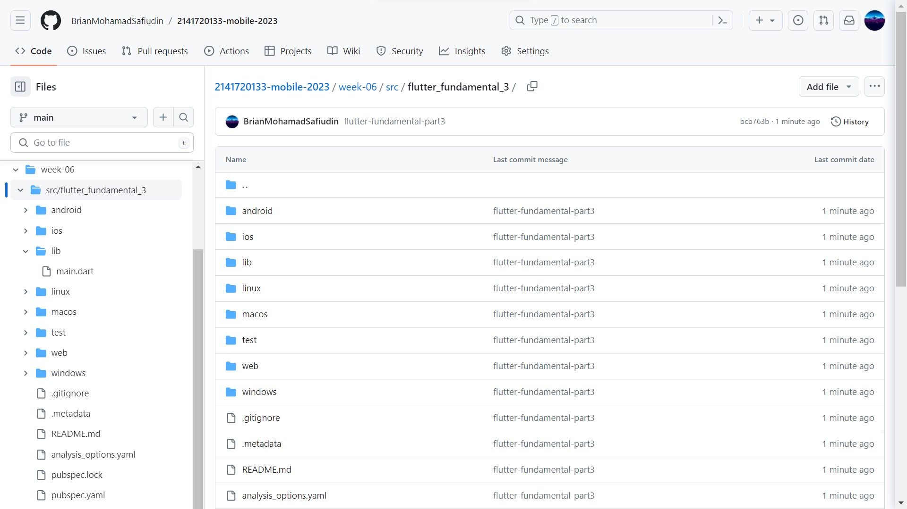
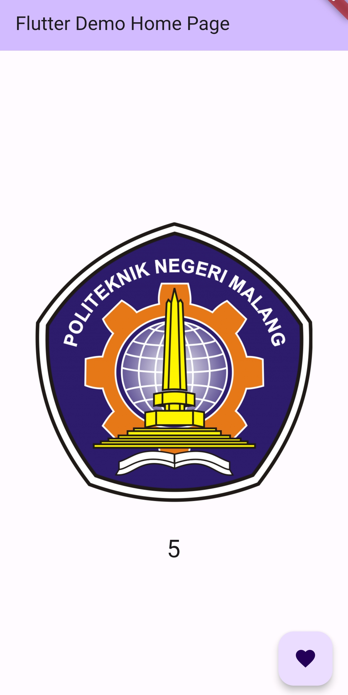

# Tugas Praktikum Pertemuan 6

### Nama : Brian Mohamad Safiudin
### NIM : 2141720133
### Kelas : TI-3F

# Praktikum 1: Menerapkan Gesture Detector

## Langkah 1 : Buat Project Baru
#### Buatlah sebuah project flutter baru dengan nama flutter_fundamental_3. Lalu jadikan repository di GitHub Anda dengan nama flutter-fundamental-part3.

## Langkah 2 : Menambahkan GestureDetector
#### Buka file main.dart lalu ganti bagian body dengan kode berikut. Untuk MyImageWidget() dapat Anda ganti dengan widget milik Anda sendiri.
###### body: Center(
######        child: GestureDetector(
######            onTap: _incrementCounter,
######            child: Column(
######              mainAxisAlignment: MainAxisAlignment.center,
######              children: <Widget>[
######                const MyImageWidget(),
######                Text(
######                  '$_counter',
######                  style: Theme.of(context).textTheme.headline4,
######                ),
######              ],
######            )),
######      ),

## Langkah 3 : Buat Dokumentasi atau Laporan Praktikum
#### Simpan lalu coba untuk Run project Anda. Untuk kode MyImageWidget() di sini menampilkan logo Polinema seperti gambar berikut. Jika Anda coba klik/tap pada gambar, maka angka di bawah akan terus bertambah. Mengapa demikian? Jelaskan dalam laporan README.md! Jangan lupa kode dan hasil tampilannya di screenshot.

## Langkah 4 : Eksperimen Jenis Gesture Lain
#### Sekarang Anda ganti kode bagian onTap dari Langkah 2 dengan onDoubleTap dan onLongPress. Lalu screenshot masing-masing hasil tampilannya dan jelaskan fungsinya!

###### Fungsi onDoubleTap digunakan untuk menangani peristiwa sentuh layar ganda. Fungsi ini akan dipanggil ketika pengguna menyentuh layar dua kali dalam waktu singkat.

###### Fungsi onLongPress digunakan untuk menangani peristiwa sentuh layar lama. Fungsi ini akan dipanggil ketika pengguna menyentuh layar dalam waktu lama.

# Praktikum 2: Menerapkan Input Widget dan Forms

## Langkah 1 : Buat class FormContoh
#### Buatlah file baru dengan nama forms.dart lalu buat class FormContoh seperti kode berikut

