# Tugas Praktikum Pertemuan 7

### Nama : Brian Mohamad Safiudin
### NIM : 2141720133
### Kelas : TI-3F

# Praktikum 1: Membangun Layout di Flutter

## Langkah 1: Buat Project Baru
#### Buatlah sebuah project flutter baru dengan nama layout_flutter. Atau sesuaikan style laporan praktikum yang Anda buat.

## Langkah 2: Buka file lib/main.dart
#### Buka file main.dart lalu ganti dengan kode berikut. Isi nama dan NIM Anda di text title.
```
import 'package:flutter/material.dart';

void main() => runApp(const MyApp());

class MyApp extends StatelessWidget {
  const MyApp({super.key});

  @override
  Widget build(BuildContext context) {
    return MaterialApp(
      title: 'Flutter layout: Nama dan NIM Anda',
      home: Scaffold(
        appBar: AppBar(
          title: const Text('Flutter layout demo'),
        ),
        body: const Center(
          child: Text('Hello World'),
        ),
      ),
    );
  }
}
```

## Langkah 3: Identifikasi layout diagram
#### Pertama, identifikasi elemen yang lebih besar. Dalam contoh ini, empat elemen disusun menjadi sebuah kolom: sebuah gambar, dua baris, dan satu blok teks.
#### Selanjutnya, buat diagram setiap baris. Baris pertama, disebut bagian Judul, memiliki 3 anak: kolom teks, ikon bintang, dan angka. Anak pertamanya, kolom, berisi 2 baris teks. Kolom pertama itu memakan banyak ruang, sehingga harus dibungkus dengan widget yang Diperluas.
#### Baris kedua, disebut bagian Tombol, juga memiliki 3 anak: setiap anak merupakan kolom yang berisi ikon dan teks.
#### Setelah tata letak telah dibuat diagramnya, cara termudah adalah dengan menerapkan pendekatan bottom-up. Untuk meminimalkan kebingungan visual dari kode tata letak yang banyak bertumpuk, tempatkan beberapa implementasi dalam variabel dan fungsi.

## Hasil Running Praktikum 1
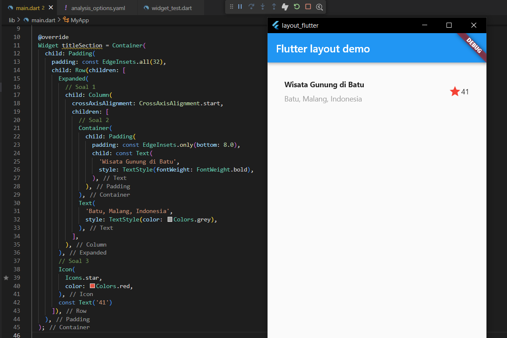  
#### Pada Praktikum 1 kita membuat widget baru bernama titleSection yang berisi beberapa widget dan menampilkan Text serta Icon dalam 1 row

# Praktikum 2: Implementasi button row

## Langkah 1: Buat method Column _buildButtonColumn
```
class MyApp extends StatelessWidget {
  const MyApp({super.key});

  @override
  Widget build(BuildContext context) {
    // ···
  }

  Column _buildButtonColumn(Color color, IconData icon, String label) {
    return Column(
      mainAxisSize: MainAxisSize.min,
      mainAxisAlignment: MainAxisAlignment.center,
      children: [
        Icon(icon, color: color),
        Container(
          margin: const EdgeInsets.only(top: 8),
          child: Text(
            label,
            style: TextStyle(
              fontSize: 12,
              fontWeight: FontWeight.w400,
              color: color,
            ),
          ),
        ),
      ],
    );
  }
}
```

## Langkah 2: Buat widget buttonSection
```
Color color = Theme.of(context).primaryColor;

Widget buttonSection = Row(
  mainAxisAlignment: MainAxisAlignment.spaceEvenly,
  children: [
    _buildButtonColumn(color, Icons.call, 'CALL'),
    _buildButtonColumn(color, Icons.near_me, 'ROUTE'),
    _buildButtonColumn(color, Icons.share, 'SHARE'),
  ],
);
```

## Langkah 3: Tambah button section ke body

## Hasil Run Praktikum 2
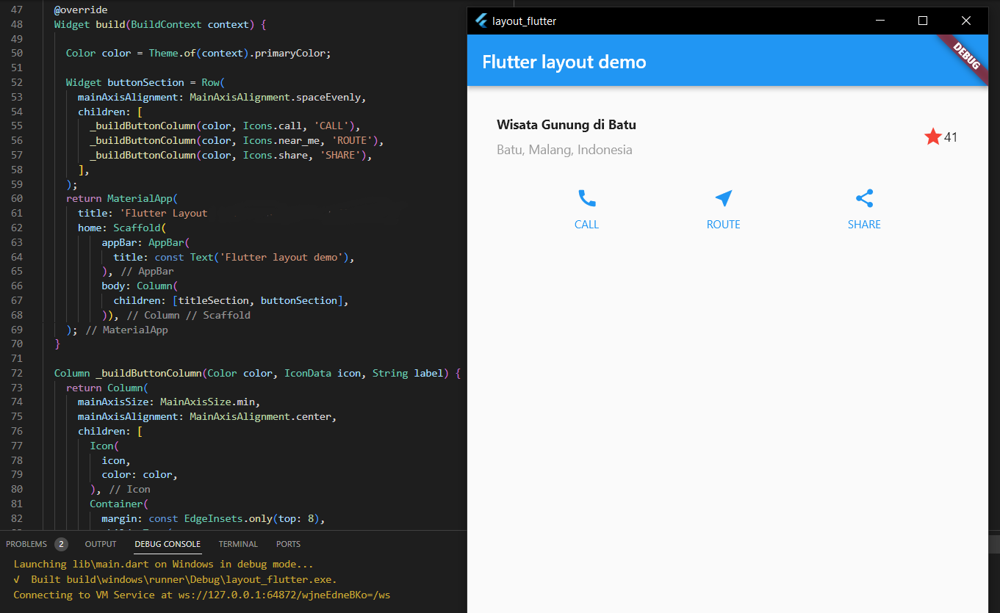  
#### pada praktikum 2 ditambahkan 1 widget bernama buttonSection yang ambil dari metod _buildButtonColumn untuk menampilkan 3 icon, 3 label, dan warna.

## Praktikum 3: Implementasi text section

## Langkah 1: Buat widget textSection
```
Widget textSection = Container(
  padding: const EdgeInsets.all(32),
  child: const Text(
    'Carilah teks di internet yang sesuai '
    'dengan foto atau tempat wisata yang ingin '
    'Anda tampilkan. '
    'Tambahkan nama dan NIM Anda sebagai '
    'identitas hasil pekerjaan Anda. '
    'Selamat mengerjakan 🙂.',
    softWrap: true,
  ),
);
```
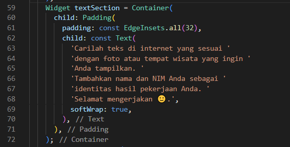

## Langkah 2: Tambahkan variabel text section ke body
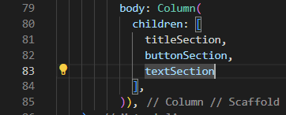

## Hasil Run Praktikum 3
#### menambahkan berupa text dibawah icon2

## Praktikum 4: Implementasi image section

## Langkah 1: Siapkan aset gambar
#### Anda dapat mencari gambar di internet yang ingin ditampilkan. Buatlah folder images di root project layout_flutter. Masukkan file gambar tersebut ke folder images, lalu set nama file tersebut ke file pubspec.yaml seperti berikut: Contoh nama file gambar di atas adalah lake.jpg
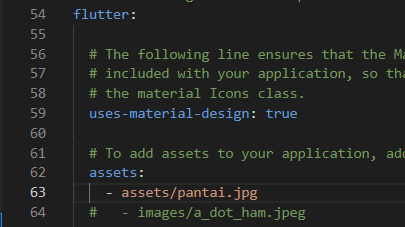

## Langkah 2: Tambahkan gambar ke body
#### Tambahkan aset gambar ke dalam body seperti berikut:
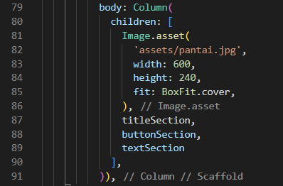
#### BoxFit.cover memberi tahu kerangka kerja bahwa gambar harus sekecil mungkin tetapi menutupi seluruh kotak rendernya.

## Langkah 3: Terakhir, ubah menjadi ListView
#### Pada langkah terakhir ini, atur semua elemen dalam ListView, bukan Column, karena ListView mendukung scroll yang dinamis saat aplikasi dijalankan pada perangkat yang resolusinya lebih kecil.
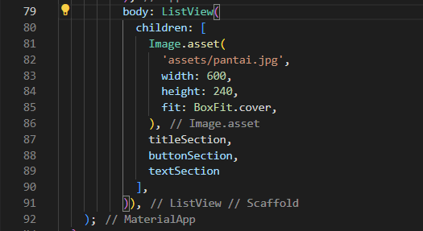

## Hasil Run Praktikum 4
#### menambahkan berupa gambar yang diupload ke folder assets lalu dipanggil ke body main.dart

## Hasil Akhir Praktikum
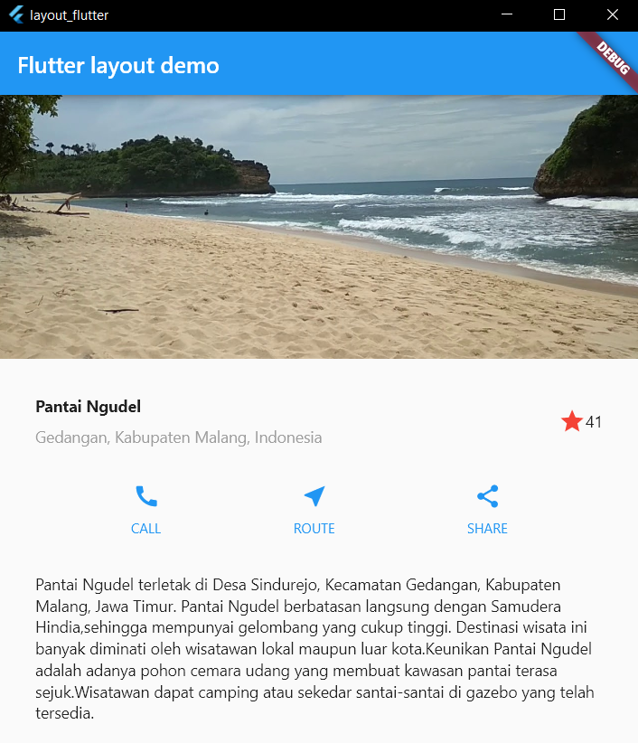  
#### disini saya mengubah nama dan lokasi dan mengubah children column menjadi listview agar bisa discroll ke atas bawah

# Tugas Praktikum 1

## Selesaikan Praktikum 1 sampai 4, lalu dokumentasikan dan push ke repository Anda berupa screenshot setiap hasil pekerjaan beserta penjelasannya di file README.md!
#### Sudah selesai diatas.

## Silakan implementasikan di project baru "basic_layout_flutter" dengan mengakses sumber ini: https://docs.flutter.dev/codelabs/layout-basics

| judul | sebelum di ubah | setelah di ubah | Keterangan |
| :---: | :-------------: | :-------------: | :--------: |
| Row and Column classes | 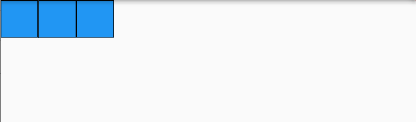 | 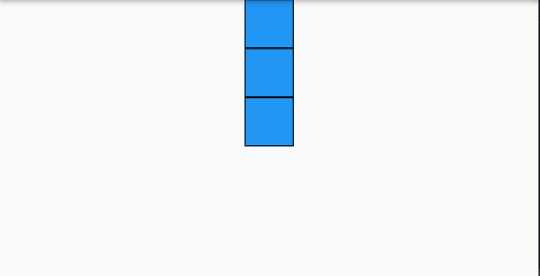 | mengubah widget Row() menjadi Column(), jelas terlihat perubahan |
| Axis size and alignment |
| mainAxisSize property |  | 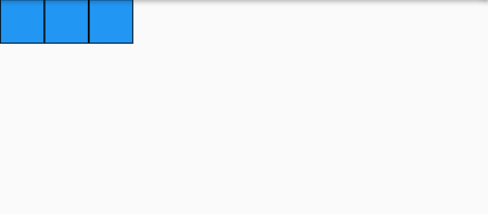 | mengubah mainAxisSize.max menjadi mainAxisAlignment.min, seperti tidak terlihat perubahan pada gambar |
| mainAxisAlignment property | 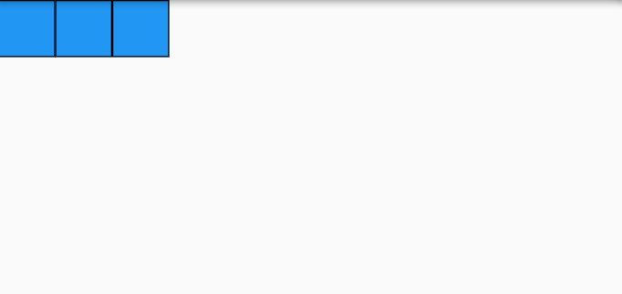 | 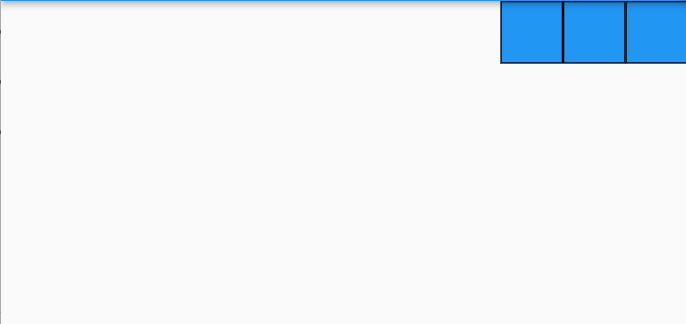 | mengubah mainAxisAlignment.start menjadi mainAxisAlignment.end merubah posisi bluebox dari pojok kiri ke pojok kanan |
| crossAxisAlignment property | 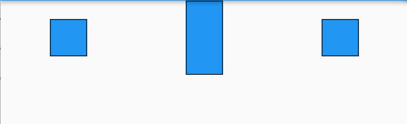 | 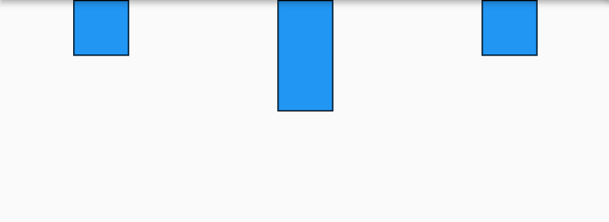 | mengubah crossAxisAlignment.center menjadi crossAxisAlignment.start mengubah posisi bluebox kecil dari tengah menjadi lebih ke atas |
| Flexible widget | 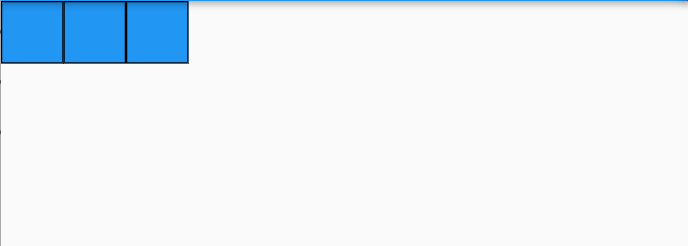 | 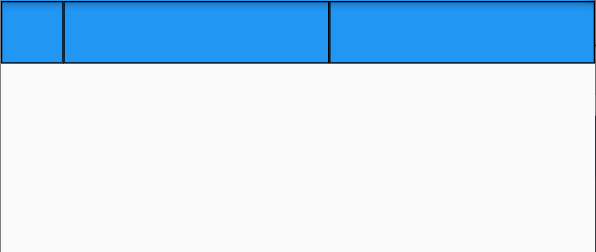 | mengubah flexFit.loose menjadi flexFit.tight dimana flexFit.loose tidak bisa memanjang melebihi ukuran namun bisa menyusut, sedangkan tight bisa memanjang tanpa melebihi layar tapi juga tidak menjadikan full dan menyusut |
| Expanded widget | 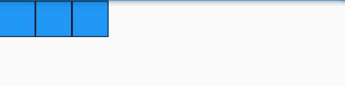 | 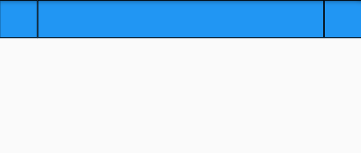 | wrap bluebox yang kedua dengan widget expanded menjadikan bluebox kedua bisa memanjang sampai ke full layar tanpa melebihi layar tsb | 
| SizedBox widget | 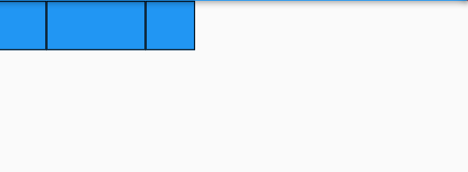 | 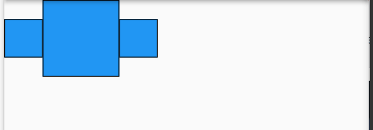 | mengubah bluebox kedua dengan menambahkan height dan weight sesuai dengan yang di inputkan user |
| Spacer widget | 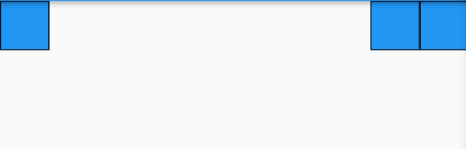 | 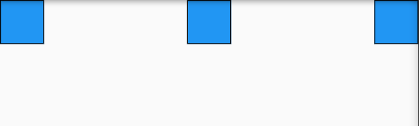 | menambahkan satu spacer(flex: 1) diantara bluebox 2 dan 3 menjadikan bluebox kedua ke tengah
| Text Widget | 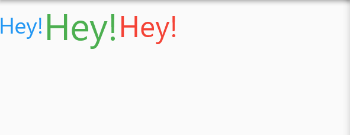 | 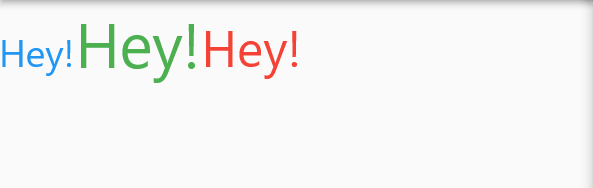 | mengubah crossAxisAlignment.center ke crossAxisAlignment.baseline merubah text yang awalnya sejajar di tengah menjadi sejajar dari bawah
| Icon Widget | 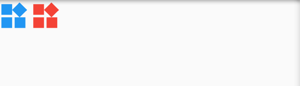 | 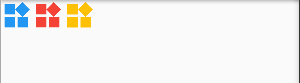 | menambahkan satu icons.widget dengan warna amber
| Image Widget | 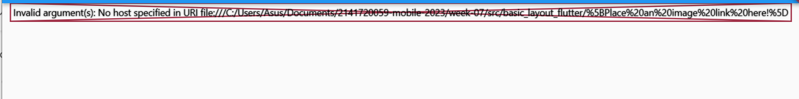 | 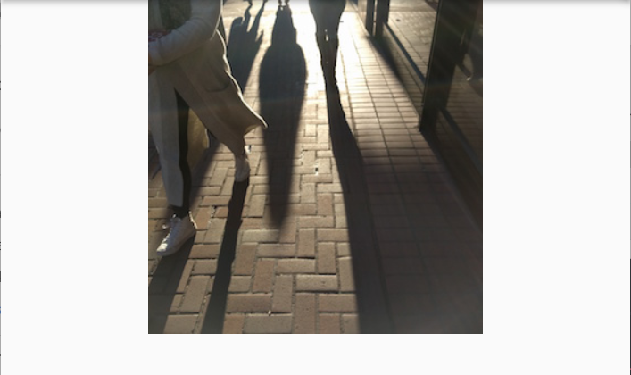 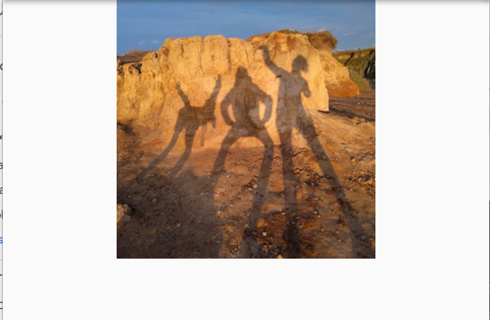 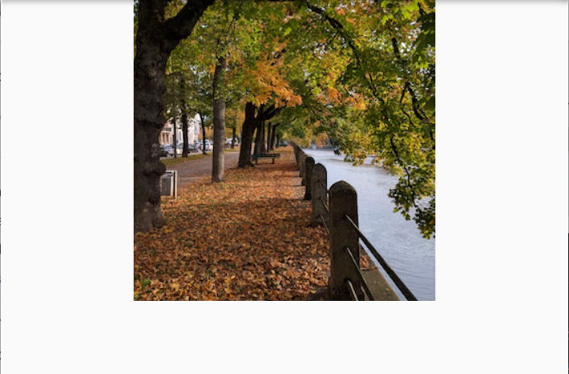 | menambahkan link pada image.network dengan link dan mengubah pic1 dengan pic2 dan juga pic3
| putting it all together | part 1  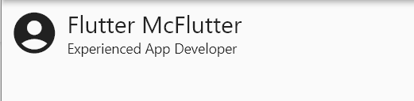 | part 2  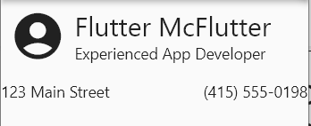  part 3  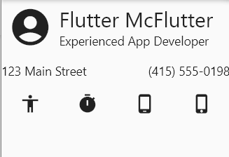 | menambahkan semua yang telah dipelajari menjadi satu