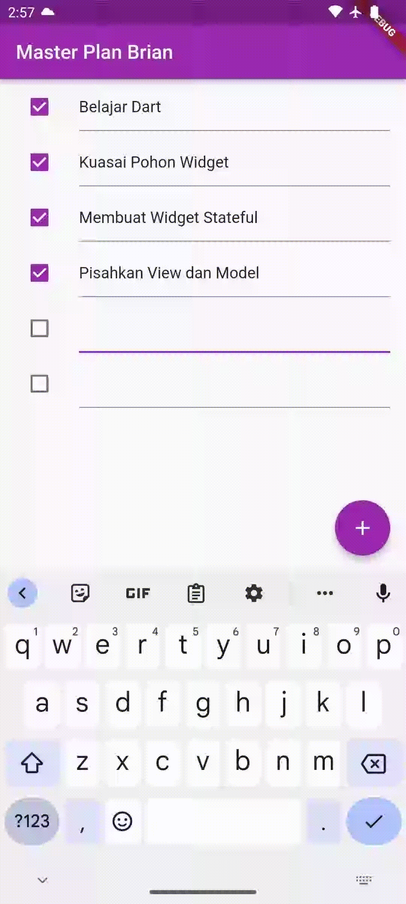
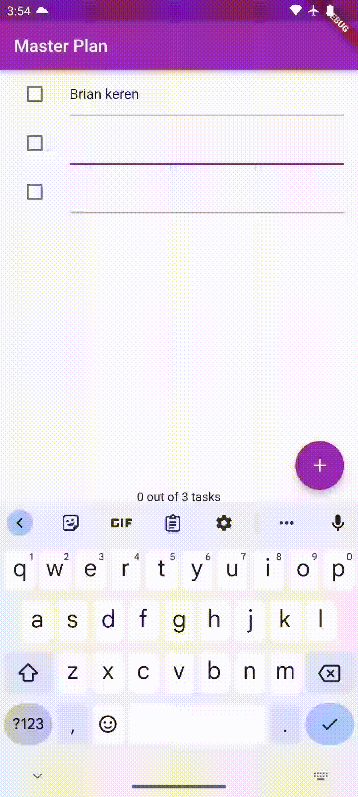

# Tugas Praktikum Pertemuan 11

### Nama : Brian Mohamad Safiudin
### NIM : 2141720133
### Kelas : TI-3F

# Praktikum 1: Dasar State dengan Model-View

## 1. Selesaikan langkah-langkah praktikum tersebut, lalu dokumentasikan berupa GIF hasil akhir praktikum beserta penjelasannya di file README.md!

### Hasil Eksekusi Program

### 2. Jelaskan maksud dari langkah 4 pada praktikum tersebut! Mengapa dilakukan demikian?

- Pada langkah 4, data_layer digunakan untuk menyimpan  file plan.dart dan task.dart yang di import ke plan_screen jadi hanya  data_layer yang di import.

### 3. Mengapa perlu variabel plan di langkah 6 pada praktikum tersebut? Mengapa dibuat konstanta ?

- Karena variabel plan dibuat untuk menyimpan objek Plan yang digunakan di kelas PlanScreen. Pada langkah ini, variabel plan diberikan nilai default sebagai objek Plan kosong menggunakan konstruktor konstan. Dengan memberikan nilai awal dan konstanta pada objek Plan, kita menjadikan objek Plan hanya dapat dibaca dan mempertahankan nilainya setelah inisialisasi. Dalam kursus ini, akan berguna untuk memulai dengan rencana kosong dan membuat fungsi untuk menambah dan mengubah rencana dan tugasnya.

### 4. Lakukan capture hasil dari Langkah 9 berupa GIF, kemudian jelaskan apa yang telah Anda buat!

- Langkah 9 membuat metode _buildTaskTile, yang digunakan untuk membuat item tampilan untuk setiap tugas yang tercantum dalam rencana. Ini adalah tampilan yang memungkinkan pengguna untuk melihat apakah suatu tugas telah diselesaikan dengan melihat apakah sebuah kotak dicentang.

### 5. Apa kegunaan method pada Langkah 11 dan 13 dalam lifecyle state ?

- Langkah 11 (initState()): Method initState() digunakan untuk melakukan inisialisasi state pada widget.

##### Pada langkah ini, sebuah ScrollController dideklarasikan dan dimulai dengan menambahkan listener. Fungsinya adalah untuk mengatur perilaku ketika terjadi event scroll pada ListView, khususnya untuk menghapus fokus dari semua TextField ketika terjadi scrolling. Ini membantu untuk menghindari masalah interaksi pengguna saat keyboard muncul dan sekaligus memastikan pengalaman pengguna yang lebih baik.

- Langkah 13 (dispose()): Method dispose() merupakan bagian dari siklus hidup widget dan digunakan untuk membersihkan dan melepaskan sumber daya sebelum widget dihancurkan.
 
##### Pada langkah ini, ScrollController dihentikan dan dihapus. Tujuannya adalah untuk menghindari kebocoran memori atau masalah kinerja dengan memastikan bahwa sumber daya yang digunakan oleh widget dihentikan dengan benar ketika widget tidak lagi digunakan.

# Praktikum 2: InheritedWidget

### 1. Selesaikan langkah-langkah praktikum tersebut, lalu dokumentasikan berupa GIF hasil akhir praktikum beserta penjelasannya di file README.md!

### Hasil Eksekusi Program

### 2. Jelaskan mana yang dimaksud InheritedWidget pada langkah 1 tersebut! Mengapa yang digunakan InheritedNotifier?

- InheritedWidget pada langkah 1 adalah return context.

##### dependOnInheritedWidgetOfExactType<PlanProvider>()!.notifier!;

- InheritedNotifier digunakan karena memberikan kemampuan untuk mempublikasikan notifikasi ketika ada perubahan pada data yang dipantau.Dalam konteks ini, PlanProvider menggunakan ValueNotifier untuk mengelola perubahan pada data rencana. Dengan cara ini, ketika terjadi perubahan pada data paket, PlanProvider  memberi tahu utilitas yang mendasarinya agar menggunakan data tersebut untuk membangun kembali.

### 3. Jelaskan maksud dari method di langkah 3 pada praktikum tersebut! Mengapa dilakukan demikian?

- int getcompleteCount: Metode ini menghitung jumlah tugas yang telah diselesaikan dalam rencana  menggunakan metode Where dalam daftar tugas dan menghitung  jumlah tugas dengan nilai atribut lengkap yang sebenarnya.

- Kelengkapan StringMessage: Metode ini menghasilkan pesan yang menunjukkan jumlah tugas yang  diselesaikan dari jumlah total tugas dalam rencana.

- Pesan ini mengambil informasi dari metode sebelumnya (completedCount) dan menampilkan pesan berformat yang menunjukkan jumlah tugas yang diselesaikan dari jumlah total tugas.

- Penambahan kedua metode ini berguna untuk memberikan informasi tambahan terkait  rencana yang  ditampilkan, seperti memberikan informasi jumlah tugas yang diselesaikan.

### 4. Lakukan capture hasil dari Langkah 9 berupa GIF, kemudian jelaskan apa yang telah Anda buat!

- SafeArea Tempatkan teks plan.completenessMessage di bagian bawah layar, di luar daftar tugas. Hal ini memastikan bahwa teks  tidak tertutup oleh elemen UI lainnya, seperti tombol navigasi sistem atau area status  perangkat.

# Praktikum 3: State di Multiple Screens

### 1. Selesaikan langkah-langkah praktikum tersebut, lalu dokumentasikan berupa GIF hasil akhir praktikum beserta penjelasannya di file README.md!

### Hasil Eksekusi Program

### 2. Berdasarkan Praktikum 3 yang telah Anda lakukan, jelaskan maksud dari gambar diagram berikut ini!

- Pengguna memasukkan nama rencana  baru ke dalam widget PlanCreatorScreen.

- PlanCreatorScreen Widget  menambahkan rencana  baru ke daftar rencana  melalui PlanProvider.

- PlanProvider memberi tahu semua widgetnya bahwa daftar paket telah berubah.

- Utilitas PlanScreen mendengarkan perubahan dalam daftar rencana  dan memperbarui layarnya.
 

### 3. Lakukan capture hasil dari Langkah 14 berupa GIF, kemudian jelaskan apa yang telah Anda buat!
- Pada langkah 14,  PlanCreatorScreen menyediakan fungsionalitas tambahan yang memungkinkan pengguna  membuat dan melihat daftar rencana  baru. Langkah 14 juga membantu membuat dua tampilan yang  terhubung. Layar pertama, PlanCreatorScreen, memungkinkan pengguna  membuat rencana baru, sedangkan layar kedua, PlanScreen, memungkinkan pengguna  melihat detail  rencana yang telah dibuat dan melakukan penambahan, penghapusan, atau perubahan tugas  dalam rencana tersebut. Semua ini terintegrasi menggunakan PlanProvider untuk pengelolaan data yang efisien dan terstruktur.