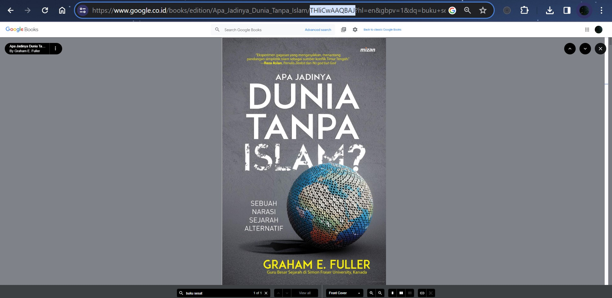
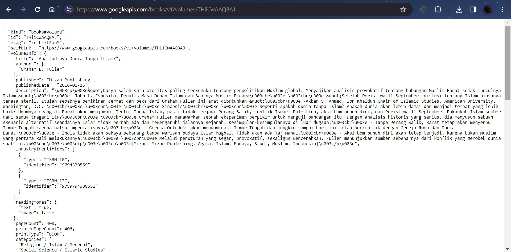

# **Tugas Praktikum Pertemuan 12**

### Nama : Brian Mohamad Safiudin
### NIM : 2141720133
### Kelas : TI-3F

---

# **Praktikum 1: Mengunduh Data dari Web Service (API)**

## **Soal 1**

### **Tambahkan nama panggilan Anda pada `title` app sebagai identitas hasil pekerjaan Anda.**

```Dart
import 'package:flutter/material.dart';
import 'dart:async';
import 'package:http/http.dart';
import 'package:http/http.dart' as http;

void main() {
  runApp(const MyApp());
}

class MyApp extends StatelessWidget {
  const MyApp({super.key});

  // This widget is the root of your application.
  @override
  Widget build(BuildContext context) {
    return MaterialApp(
      title: 'Flutter Demo Brian',
      theme: ThemeData(
        primarySwatch: Colors.blue,
        visualDensity: VisualDensity.adaptivePlatformDensity,
      ),
      home: const FuturePage(),
    );
  }
}

class FuturePage extends StatefulWidget {
  const FuturePage({super.key});

  @override
  State<FuturePage> createState() => _FuturePageState();
}

class _FuturePageState extends State<FuturePage> {
  String result = '';
  bool isLoading = false;
  @override
  Widget build(BuildContext context) {
    return Scaffold(
      appBar: AppBar(
        title: const Text('Back from the Future Brian'),
      ),
      body: Center(
        child: Column(children: [
          const Spacer(),
          ElevatedButton(
            child: Text('GO!'),
            onPressed: () {},
          ),
          const Spacer(),
          isLoading ? CircularProgressIndicator() : Text(result),
          const Spacer(),
        ]),
      ),
    );
  }

  Future<Response> getData() async {
    const authority = 'www.googleapis.com';
    const path = '/books/v1/volumes/THliCwAAQBAJ';
    Uri url = Uri.https(authority, path);
    return await http.get(url);
  }
}

```

---

## **Soal 2**

-  **Carilah judul buku favorit Anda di Google Books, lalu ganti ID buku pada variabel path di kode tersebut. Caranya ambil di URL browser Anda seperti gambar berikut ini.**

</img>

-  **Carilah judul buku favorit Anda di Google Books, lalu ganti ID buku pada variabel path di kode tersebut. Caranya ambil di URL browser Anda seperti gambar berikut ini.**

</img>

---

## **Soal 3**

-  **Jelaskan maksud kode langkah 5 tersebut terkait substring dan catchError!**

Pada langkah 5,  metode `substring(0, 450)` digunakan untuk mengambil beberapa teks dari hasil query data. Fungsi `substring` digunakan untuk memotong teks, dalam hal ini dari indeks 0 hingga indeks 449, sehingga hanya sebagian tertentu dari hasil query yang ditampilkan. Selain itu,  metode `catchError` digunakan setelah blok `then`, yang  menangani kesalahan yang mungkin terjadi selama proses pengambilan data. Jika terjadi kesalahan, blok kode di dalam `catchError` akan dieksekusi dan variabel `hasil` akan ditetapkan sebagai `Terjadi kesalahan`. `setState` kemudian dipanggil untuk memperbarui antarmuka pengguna dengan menampilkan hasil atau pesan kesalahan yang sesuai.

</img>

---

# **Praktikum 2: Menggunakan await/async untuk menghindari callbacks**

```Dart
import 'package:flutter/material.dart';
import 'dart:async';
import 'package:http/http.dart';
import 'package:http/http.dart' as http;

void main() {
  runApp(const MyApp());
}

class MyApp extends StatelessWidget {
  const MyApp({super.key});

  // This widget is the root of your application.
  @override
  Widget build(BuildContext context) {
    return MaterialApp(
      title: 'Flutter Demo Brian',
      theme: ThemeData(
        primarySwatch: Colors.blue,
        visualDensity: VisualDensity.adaptivePlatformDensity,
      ),
      home: const FuturePage(),
    );
  }
}

class FuturePage extends StatefulWidget {
  const FuturePage({super.key});

  @override
  State<FuturePage> createState() => _FuturePageState();
}

class _FuturePageState extends State<FuturePage> {
  String result = '';
  @override
  Widget build(BuildContext context) {
    return Scaffold(
      appBar: AppBar(
        title: const Text('Back from the Future Brian'),
      ),
      body: Center(
        child: Column(
          mainAxisAlignment: MainAxisAlignment.center,
          children: [
            const Spacer(),
            ElevatedButton(
                // onPressed: () {
                //   setState(() {});
                //   getData().then((value) {
                //     result = value.body.toString().substring(0, 450);
                //     setState(() {});
                //   }).catchError((_) {
                //     result = 'An error occurred';
                //     setState(() {});
                //   });
                // },
                onPressed: count,
                child: const Text("GO!")),
            const Spacer(),
            Text(result),
            const Spacer(),
            const CircularProgressIndicator(),
            const Spacer()
          ],
        ),
      ),
    );
  }

  Future<Response> getData() async {
    const authority = 'www.googleapis.com';
    const path = '/books/v1/volumes/THliCwAAQBAJ';
    Uri url = Uri.https(authority, path);
    return await http.get(url);
  }

  Future<int> returnOneAsync() async {
    await Future.delayed(const Duration(seconds: 3));
    return 1;
  }

  Future<int> returnTwoAsync() async {
    await Future.delayed(const Duration(seconds: 3));
    return 2;
  }

  Future<int> returnThreeAsync() async {
    await Future.delayed(const Duration(seconds: 3));
    return 3;
  }

  Future count() async {
    int total = 0;
    total = await returnOneAsync();
    total += await returnTwoAsync();
    total += await returnThreeAsync();
    setState(() {
      result = total.toString();
    });
  }
}
```

---

## **Soal 4**

-  **Jelaskan maksud kode langkah 1 dan 2 tersebut!**

Pada langkah 1, dilakukan penambahan tiga method baru dalam kelas `_FuturePageState`. Metode-metode ini, yaitu `returnOneAsync`, `returnTwoAsync`, dan  `returnThreeAsync`, sebenarnya melakukan operasi asinkron yang mensimulasikan penundaan selama 3 detik dan mengembalikan nilai 1, 2, dan 3 secara berturut-turut.

Pada langkah 2, dilakukan penambahan method `count`. Method ini memiliki tiga pemanggilan fungsi asinkron `(await)` ke metode-metode yang telah ditambahkan sebelumnya. Method `count` menghitung jumlah total dari hasil yang dikembalikan oleh metode-metode asinkron dan kemudian mengatur nilai `result` dalam state untuk menampilkan hasilnya.


</img>
