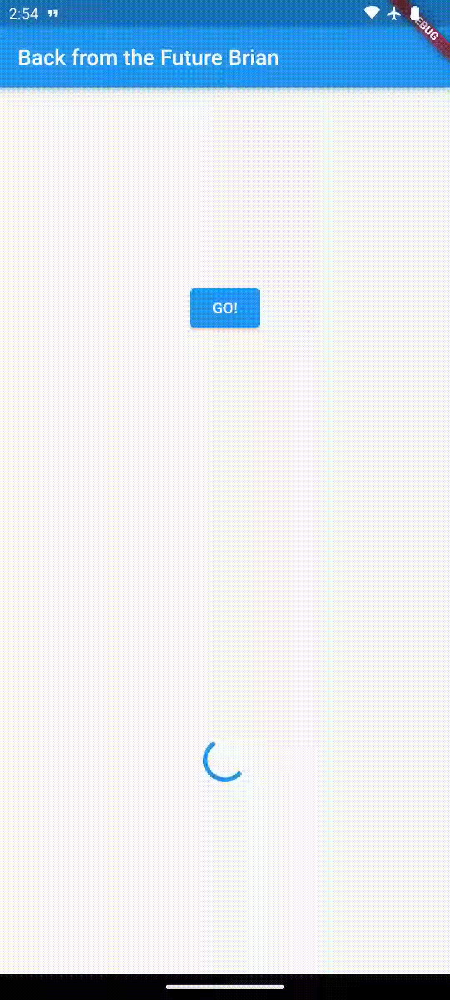
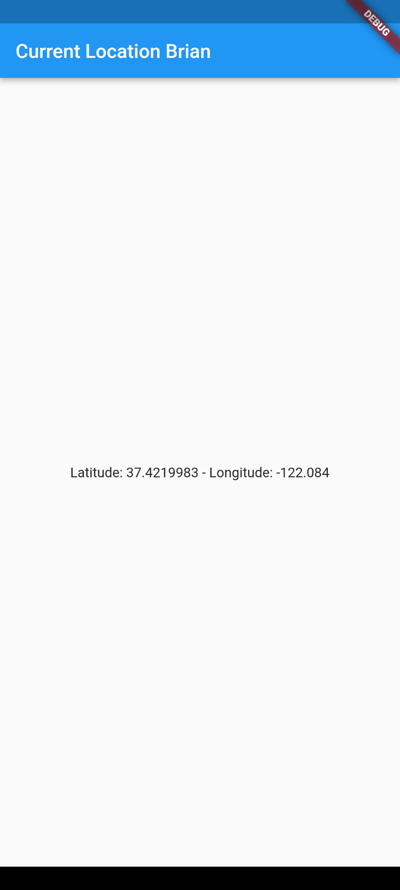
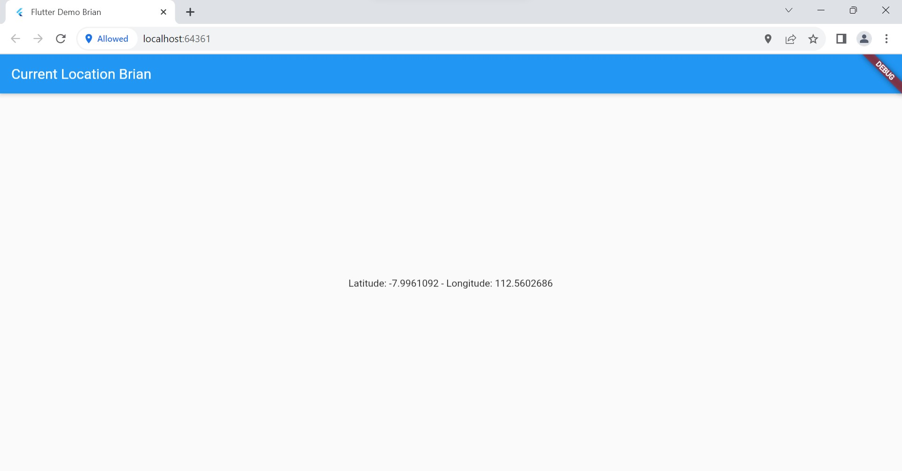

# **Tugas Praktikum Pertemuan 12**

### Nama : Brian Mohamad Safiudin
### NIM : 2141720133
### Kelas : TI-3F

---

# **Praktikum 1: Mengunduh Data dari Web Service (API)**

## **Soal 1**

### **Tambahkan nama panggilan Anda pada `title` app sebagai identitas hasil pekerjaan Anda.**

```Dart
import 'package:flutter/material.dart';
import 'dart:async';
import 'package:http/http.dart';
import 'package:http/http.dart' as http;

void main() {
  runApp(const MyApp());
}

class MyApp extends StatelessWidget {
  const MyApp({super.key});

  // This widget is the root of your application.
  @override
  Widget build(BuildContext context) {
    return MaterialApp(
      title: 'Flutter Demo Brian',
      theme: ThemeData(
        primarySwatch: Colors.blue,
        visualDensity: VisualDensity.adaptivePlatformDensity,
      ),
      home: const FuturePage(),
    );
  }
}

class FuturePage extends StatefulWidget {
  const FuturePage({super.key});

  @override
  State<FuturePage> createState() => _FuturePageState();
}

class _FuturePageState extends State<FuturePage> {
  String result = '';
  bool isLoading = false;
  @override
  Widget build(BuildContext context) {
    return Scaffold(
      appBar: AppBar(
        title: const Text('Back from the Future Brian'),
      ),
      body: Center(
        child: Column(children: [
          const Spacer(),
          ElevatedButton(
            child: Text('GO!'),
            onPressed: () {},
          ),
          const Spacer(),
          isLoading ? CircularProgressIndicator() : Text(result),
          const Spacer(),
        ]),
      ),
    );
  }

  Future<Response> getData() async {
    const authority = 'www.googleapis.com';
    const path = '/books/v1/volumes/THliCwAAQBAJ';
    Uri url = Uri.https(authority, path);
    return await http.get(url);
  }
}

```

---

## **Soal 2**

-  **Carilah judul buku favorit Anda di Google Books, lalu ganti ID buku pada variabel path di kode tersebut. Caranya ambil di URL browser Anda seperti gambar berikut ini.**

</img>

-  **Carilah judul buku favorit Anda di Google Books, lalu ganti ID buku pada variabel path di kode tersebut. Caranya ambil di URL browser Anda seperti gambar berikut ini.**

</img>

---

## **Soal 3**

-  **Jelaskan maksud kode langkah 5 tersebut terkait substring dan catchError!**

Pada langkah 5,  metode `substring(0, 450)` digunakan untuk mengambil beberapa teks dari hasil query data. Fungsi `substring` digunakan untuk memotong teks, dalam hal ini dari indeks 0 hingga indeks 449, sehingga hanya sebagian tertentu dari hasil query yang ditampilkan. Selain itu,  metode `catchError` digunakan setelah blok `then`, yang  menangani kesalahan yang mungkin terjadi selama proses pengambilan data. Jika terjadi kesalahan, blok kode di dalam `catchError` akan dieksekusi dan variabel `hasil` akan ditetapkan sebagai `Terjadi kesalahan`. `setState` kemudian dipanggil untuk memperbarui antarmuka pengguna dengan menampilkan hasil atau pesan kesalahan yang sesuai.

</img>

---

# **Praktikum 2: Menggunakan await/async untuk menghindari callbacks**

```Dart
import 'package:flutter/material.dart';
import 'dart:async';
import 'package:http/http.dart';
import 'package:http/http.dart' as http;

void main() {
  runApp(const MyApp());
}

class MyApp extends StatelessWidget {
  const MyApp({super.key});

  // This widget is the root of your application.
  @override
  Widget build(BuildContext context) {
    return MaterialApp(
      title: 'Flutter Demo Brian',
      theme: ThemeData(
        primarySwatch: Colors.blue,
        visualDensity: VisualDensity.adaptivePlatformDensity,
      ),
      home: const FuturePage(),
    );
  }
}

class FuturePage extends StatefulWidget {
  const FuturePage({super.key});

  @override
  State<FuturePage> createState() => _FuturePageState();
}

class _FuturePageState extends State<FuturePage> {
  String result = '';
  @override
  Widget build(BuildContext context) {
    return Scaffold(
      appBar: AppBar(
        title: const Text('Back from the Future Brian'),
      ),
      body: Center(
        child: Column(
          mainAxisAlignment: MainAxisAlignment.center,
          children: [
            const Spacer(),
            ElevatedButton(
                // onPressed: () {
                //   setState(() {});
                //   getData().then((value) {
                //     result = value.body.toString().substring(0, 450);
                //     setState(() {});
                //   }).catchError((_) {
                //     result = 'An error occurred';
                //     setState(() {});
                //   });
                // },
                onPressed: count,
                child: const Text("GO!")),
            const Spacer(),
            Text(result),
            const Spacer(),
            const CircularProgressIndicator(),
            const Spacer()
          ],
        ),
      ),
    );
  }

  Future<Response> getData() async {
    const authority = 'www.googleapis.com';
    const path = '/books/v1/volumes/THliCwAAQBAJ';
    Uri url = Uri.https(authority, path);
    return await http.get(url);
  }

  Future<int> returnOneAsync() async {
    await Future.delayed(const Duration(seconds: 3));
    return 1;
  }

  Future<int> returnTwoAsync() async {
    await Future.delayed(const Duration(seconds: 3));
    return 2;
  }

  Future<int> returnThreeAsync() async {
    await Future.delayed(const Duration(seconds: 3));
    return 3;
  }

  Future count() async {
    int total = 0;
    total = await returnOneAsync();
    total += await returnTwoAsync();
    total += await returnThreeAsync();
    setState(() {
      result = total.toString();
    });
  }
}
```

---

## **Soal 4**

-  **Jelaskan maksud kode langkah 1 dan 2 tersebut!**

Pada langkah 1, dilakukan penambahan tiga method baru dalam kelas `_FuturePageState`. Metode-metode ini, yaitu `returnOneAsync`, `returnTwoAsync`, dan  `returnThreeAsync`, sebenarnya melakukan operasi asinkron yang mensimulasikan penundaan selama 3 detik dan mengembalikan nilai 1, 2, dan 3 secara berturut-turut.

Pada langkah 2, dilakukan penambahan method `count`. Method ini memiliki tiga pemanggilan fungsi asinkron `(await)` ke metode-metode yang telah ditambahkan sebelumnya. Method `count` menghitung jumlah total dari hasil yang dikembalikan oleh metode-metode asinkron dan kemudian mengatur nilai `result` dalam state untuk menampilkan hasilnya.


</img>

---

# **Praktikum 3: Menggunakan Completer di Future**

```Dart
import 'package:flutter/material.dart';
import 'dart:async';
import 'package:http/http.dart';
import 'package:http/http.dart' as http;
import 'package:async/async.dart';

void main() {
  runApp(const MyApp());
}

class MyApp extends StatelessWidget {
  const MyApp({super.key});

  // This widget is the root of your application.
  @override
  Widget build(BuildContext context) {
    return MaterialApp(
      title: 'Flutter Demo Brian',
      theme: ThemeData(
        primarySwatch: Colors.blue,
        visualDensity: VisualDensity.adaptivePlatformDensity,
      ),
      home: const FuturePage(),
    );
  }
}

class FuturePage extends StatefulWidget {
  const FuturePage({super.key});

  @override
  State<FuturePage> createState() => _FuturePageState();
}

class _FuturePageState extends State<FuturePage> {
  String result = '';
  late Completer completer;

  @override
  Widget build(BuildContext context) {
    return Scaffold(
      appBar: AppBar(
        title: const Text('Back from the Future Brian'),
      ),
      body: Center(
        child: Column(
          mainAxisAlignment: MainAxisAlignment.center,
          children: [
            const Spacer(),
            ElevatedButton(
              onPressed: () {
                getNumber().then((value) {
                  setState(() {
                    result = value.toString();
                  });
                }).catchError((e) {
                  result = 'An error Occured';
                });
              },
              child: const Text("GO!"),
            ),
            const Spacer(),
            Text(result),
            const Spacer(),
            const CircularProgressIndicator(),
            const Spacer()
          ],
        ),
      ),
    );
  }

  Future getNumber() {
    completer = Completer<int>();
    calculate();
    return completer.future;
  }

  calculate() async {
    try {
      await Future.delayed(const Duration(seconds: 5));
      completer.complete(42);
    } catch (e) {
      completer.completeError({});
    }
  }

  Future<Response> getData() async {
    const authority = 'www.googleapis.com';
    const path = '/books/v1/volumes/THliCwAAQBAJ';
    Uri url = Uri.https(authority, path);
    return await http.get(url);
  }

  Future<int> returnOneAsync() async {
    await Future.delayed(const Duration(seconds: 3));
    return 1;
  }

  Future<int> returnTwoAsync() async {
    await Future.delayed(const Duration(seconds: 3));
    return 2;
  }

  Future<int> returnThreeAsync() async {
    await Future.delayed(const Duration(seconds: 3));
    return 3;
  }

  Future count() async {
    int total = 0;
    total = await returnOneAsync();
    total += await returnTwoAsync();
    total += await returnThreeAsync();
    setState(() {
      result = total.toString();
    });
  }
}
```

---

## **Soal 5**

-  **Jelaskan maksud kode langkah 2 tersebut!**

Langkah 2 dalam kode tersebut memberikan pengenalan konsep `Completer` dalam Flutter. Pertama mendeklarasikan variabel `completer` sebagai `late Completer`, yang artinya nilai variabel ini akan diinisialisasi sebelum digunakan. Selanjutnya ada dua metode yang ditambahkan.

Method pertama, `getNumber` yang bertugas membuat sebuah `Completer`, lalu memanggil method lain yaitu `calculate`. Kemudian methodeini mengembalikan `future` dari `completer`. `Future` ini yang nantinya menjadi janji bahwa suatu nilai akan tersedia di masa depan.

Method kedua, `calculate` yang mensimulasikan operasi yang membutuhkan waktu dengan cara menunda selama 5 detik menggunakan `await Future.delayed(...)`. Setelah itu, nilai `completer` diisi dengan angka 42, yang artinya operasi ini telah selesai.

</img>

---

## **Soal 6**

-  **Jelaskan maksud perbedaan kode langkah 2 dengan langkah 5-6 tersebut!**

Pada langkah 5 mengubah metode `calculate` dengan menambahkan blok `try-catch`. Jika terjadi kesalahan selama operasi asinkron (misalnya, penundaan gagal), blok `catch` akan menangkap kesalahan tersebut, dan `completer` akan diselesaikan dengan sebuah objek kosong `{}`. Langkah 6 adalah bagian dari fungsi `onPressed` pada tombol "GO!" yang memanggil metode `getNumber`. Pada langkah ini, setelah pemanggilan `getNumber`, `then` digunakan untuk menangkap hasilnya. Dalam blok `then`, nilai hasil dikonversi menjadi string dan diperbarui ke dalam variabel `result` melalui `setState`. Jika ada kesalahan, `catchError` akan menangkapnya dan mengatur `result` ke string "An error Occurred".

</img>

---

# **Praktikum 4: Memanggil Future secara paralel**

```Dart
import 'package:flutter/material.dart';
import 'dart:async';
import 'package:http/http.dart';
import 'package:http/http.dart' as http;
import 'package:async/async.dart';

void main() {
  runApp(const MyApp());
}

class MyApp extends StatelessWidget {
  const MyApp({super.key});

  // This widget is the root of your application.
  @override
  Widget build(BuildContext context) {
    return MaterialApp(
      title: 'Flutter Demo Brian',
      theme: ThemeData(
        primarySwatch: Colors.blue,
        visualDensity: VisualDensity.adaptivePlatformDensity,
      ),
      home: const FuturePage(),
    );
  }
}

class FuturePage extends StatefulWidget {
  const FuturePage({super.key});

  @override
  State<FuturePage> createState() => _FuturePageState();
}

class _FuturePageState extends State<FuturePage> {
  String result = '';
  late Completer completer;

  @override
  Widget build(BuildContext context) {
    return Scaffold(
      appBar: AppBar(
        title: const Text('Back from the Future Brian'),
      ),
      body: Center(
        child: Column(
          mainAxisAlignment: MainAxisAlignment.center,
          children: [
            const Spacer(),
            ElevatedButton(
              onPressed: returnFG,
              child: const Text("GO!"),
            ),
            const Spacer(),
            Text(result),
            const Spacer(),
            const CircularProgressIndicator(),
            const Spacer()
          ],
        ),
      ),
    );
  }

  Future getNumber() {
    completer = Completer<int>();
    calculate();
    return completer.future;
  }

  calculate() async {
    try {
      await Future.delayed(const Duration(seconds: 5));
      completer.complete(42);
    } catch (e) {
      completer.completeError({});
    }
  }

  void returnFG() {
    final futures = Future.wait<int>([
      returnOneAsync(),
      returnTwoAsync(),
      returnThreeAsync(),
    ]);
    // FutureGroup<int> futureGroup = FutureGroup<int>();
    // futureGroup.add(returnOneAsync());
    // futureGroup.add(returnTwoAsync());
    // futureGroup.add(returnThreeAsync());
    // futureGroup.close();
    futures.then((value) {
      int total = 0;
      for (var element in value) {
        total += element;
      }
      setState(() {
        result = total.toString();
      });
    });
  }

  Future<Response> getData() async {
    const authority = 'www.googleapis.com';
    const path = '/books/v1/volumes/THliCwAAQBAJ';
    Uri url = Uri.https(authority, path);
    return await http.get(url);
  }

  Future<int> returnOneAsync() async {
    await Future.delayed(const Duration(seconds: 3));
    return 1;
  }

  Future<int> returnTwoAsync() async {
    await Future.delayed(const Duration(seconds: 3));
    return 2;
  }

  Future<int> returnThreeAsync() async {
    await Future.delayed(const Duration(seconds: 3));
    return 3;
  }

  Future count() async {
    int total = 0;
    total = await returnOneAsync();
    total += await returnTwoAsync();
    total += await returnThreeAsync();
    setState(() {
      result = total.toString();
    });
  }
}

```

---

## **Soal 7**

-  **Capture hasil praktikum Anda berupa GIF dan lampirkan di README. Lalu lakukan commit dengan pesan "W12: Soal 7".**

</img>

---

## **Soal 8**

-  **Jelaskan maksud perbedaan kode langkah 1 dan 4!.**

Langkah 1, menggunakan objek `FutureGroup` untuk mengelola sekelompok `Future`. Setiap `Future` ditambahkan ke dalam `FutureGroup` menggunakan methode `add`. Selanjutnya, method `close` dipanggil untuk menandai akhir dari grup `Future`. Setelah itu, `FutureGroup.future` digunakan untuk mendapatkan `Future` tunggal yang menunggu kelompok `Future` selesai. Kemudian, hasil dari setiap `Future` dijumlahkan untuk menghitung total, dan hasilnya diperbarui dalam UI melalui penggunaaan  `setState`.

Sedangkan pada langkah 4, digunakan fungsi `Future.wait` untuk menunggu sejumlah `Future` selesai. Daftar `Future` yang akan ditunggu diatur dalam bentuk `list`, dan `Future.wait` secara langsung menunggu semua `Future` dalam `list` selesai. Setelah itu, hasil dari setiap `Future` dijumlahkan untuk menghitung total, dan hasilnya diperbarui dalam UI melalui `setState`.

Perbedaan utama antara keduanya terletak pada cara mengelola dan menunggu kelompok `Future`. Langkah 1 menggunakan objek `FutureGroup`, sedangkan Langkah 4 langsung menggunakan `Future.wait` untuk menangani beberapa `Future` secara bersamaan. Langkah 4 dapat dianggap lebih langsung dan mudah dipahami, sementara Langkah 1 menunjukkan pendekatan yang lebih modular dengan penggunaan objek `FutureGroup`.

---

# **Praktikum 5: Menangani Respon Error pada Async Code**

- Ada beberapa teknik untuk melakukan handle error pada code async. Pada praktikum ini Anda akan menggunakan 2 cara, yaitu then() callback dan pola async/await.

- Setelah Anda menyelesaikan praktikum 4, Anda dapat melanjutkan praktikum 5 ini. Selesaikan langkah-langkah praktikum berikut ini menggunakan editor Visual Studio Code (VS Code) atau Android Studio atau code editor lain kesukaan Anda. Jawablah di laporan praktikum Anda pada setiap soal yang ada di beberapa langkah praktikum ini.

---

## **Soal 9**

-  **Capture hasil praktikum Anda berupa GIF dan lampirkan di `README`. Lalu lakukan commit dengan pesan "W12: Soal 9".**

</img>

---

## **Soal 10**

- Panggil method `handleError()` tersebut di `ElevatedButton`, lalu run. Apa hasilnya? Jelaskan perbedaan kode langkah 1 dan 4!

Setelah method `handleError()` dipanggil, maka outputnya akan tetap sama yaitu pesan kesalahan **'Exception: Something terrible happened!'** akan tetap ditampilkan. Namun kedua kode pada langkah 1 dan 4 tersebut memiliki perbedaan dalam menangani error yang terjadi.

Pada langkah 1, meskipun method `returnError()` melemparkan pengecualian, tidak ada blok `try-catch` di sekitarnya. Oleh karena itu, ketika memanggil `returnError()`, pengecualian akan diteruskan tanpa ditangani. Ini dapat menyebabkan aplikasi berhenti atau menampilkan pesan kesalahan tanpa penanganan khusus.

Pada langkah 4, method `handleError()` akan mengeksekusi `returnError()` dalam blok `try`. Jika ada kesalahan selama eksekusi `returnError()`, blok `catch` akan dijalankan, dan pesan kesalahan akan diperbarui dalam `setState`. Oleh karena itu, setelah pemanggilan `handleError()`, meskipun pesan kesalahan tetap sama, aplikasi dapat melanjutkan berjalan karena penanganan kesalahan yang dilakukan di dalam blok `catch`.

---

# **Praktikum 6: Menggunakan Future dengan StatefulWidget**

- Seperti yang Anda telah pelajari, Stateless widget tidak dapat menyimpan informasi (state), StatefulWidget dapat mengelola variabel dan properti dengan method setState(), yang kemudian dapat ditampilkan pada UI. State adalah informasi yang dapat berubah selama life cycle widget itu berlangsung.

##### Ada 4 method utama dalam life cycle StatefullWidget:

- initState(): dipanggil sekali ketika state dibangun. Bisa dikatakan ini juga sebagai konstruktor class.

- build(): dipanggil setiap kali ada perubahan state atau UI. Method ini melakukan destroy UI dan membangun ulang dari nol.

- deactive() dan dispose(): digunakan untuk menghapus widget dari tree, pada beberapa kasus dimanfaatkan untuk menutup koneksi ke database atau menyimpan data sebelum berpindah screen.

---

## **Soal 11**

- Tambahkan nama panggilan Anda pada tiap properti title sebagai identitas pekerjaan Anda.

</img>

---

## **Soal 12**

- Jika Anda tidak melihat animasi loading tampil, kemungkinan itu berjalan sangat cepat. Tambahkan delay pada method getPosition() dengan kode await Future.delayed(const Duration(seconds: 3));

- Apakah Anda mendapatkan koordinat GPS ketika run di browser? Mengapa demikian?

Hasil Run Browser:

</img>

Jika menjalankan di browser, koordinat GPS masih dapat muncul atau diperoleh. Ini disebabkan oleh Flutter web yang menggunakan API Geolocation langsung dari browser. Pada Flutter web, izin untuk mengakses lokasi dikelola oleh browser, bukan oleh sistem operasi (seperti Android pada perangkat seluler). Oleh karena itu, meskipun tidak menambahkan izin secara langsung ke `AndroidManifest`, koordinat GPS masih dapat diperoleh di browser, tetapi tetap memerlukan izin dari pengguna.

Hasil Run Android:

</img>

---

# **Praktikum 7: Manajemen Future dengan FutureBuilder**

- Pola ketika menerima beberapa data secara async dan melakukan update pada UI sebenarnya itu tergantung pada ketersediaan data. Secara umum fakta di Flutter, ada sebuah widget yang membantu Anda untuk memudahkan manajemen future yaitu widget FutureBuilder.

- Anda dapat menggunakan FutureBuilder untuk manajemen future bersamaan dengan update UI ketika ada update Future. FutureBuilder memiliki status future sendiri, sehingga Anda dapat mengabaikan penggunaan setState, Flutter akan membangun ulang bagian UI ketika update itu dibutuhkan.

---

## **Soal 13**

- Apakah ada perbedaan UI dengan praktikum sebelumnya? Mengapa demikian?

- Seperti yang Anda lihat, menggunakan FutureBuilder lebih efisien, clean, dan reactive dengan Future bersama UI.

Dari kedua praktikum tersebut tidak memiliki perbedaan UI. Keduanya tetap menampilkan koordinat Geolokasi dengan layout yang sama. Hal ini terjadi karena keduanya masih mengambil lokasi secara sinkron dalam blok `initState`. Pada tampilan UI keduanya memiliki delay yang sama, yaitu 3 detik. Selain itu, UI dapat terlihat sama karena `FutureBuilder` secara otomatis mengelola pembaruan UI, bahkan tanpa pemanggilan `setState` langsung.

</img>

---

## **Soal 14**

- Apakah ada perbedaan UI dengan praktikum sebelumnya? Mengapa demikian?

Tidak ada perbedaan UI dengan langkah sebelumnya. Hal ini dikarenakan pada langkah ini hanya menambahkan `handleError()` yang akan dijalankan ketika terdapat kesalahan. Namun karena pada langkah ini tidak ada kesalahan yang terjadi selama pemrosesan data lokasi. Oleh karena itu, pesan **Something terrible happened!** dari blok penanganan kesalahan tidak ditampilkan.

</img>

---

# **Praktikum 8: Navigation route dengan Future Function**

- Praktikum kali ini Anda akan melihat manfaat Future untuk Navigator dalam transformasi Route menjadi sebuah function async. Anda akan melakukan push screen baru dan fungsi await menunggu data untuk melakukan update warna background pada screen.

---

## **Soal 15**

- Tambahkan nama panggilan Anda pada tiap properti title sebagai identitas pekerjaan Anda.

- Silakan ganti dengan warna tema favorit Anda.

```Dart
import 'package:flutter/material.dart';

class NavigationFirst extends StatefulWidget {
  const NavigationFirst({super.key});

  @override
  State<NavigationFirst> createState() => _NavigationFirstState();
}

class _NavigationFirstState extends State<NavigationFirst> {
  Color color = Colors.orange.shade700;

  @override
  Widget build(BuildContext context) {
    return Scaffold(
      backgroundColor: color,
      appBar: AppBar(
        title: const Text("Navigation First Screen Brian"),
      ),
      body: Center(
        child: ElevatedButton(
            child: const Text('Change color'),
            onPressed: () {
              _navigateAndGetColor(context);
            }),
      ),
    );
  }
}
```

---

## **Soal 16**

- Cobalah klik setiap button, apa yang terjadi ? Mengapa demikian ?

- Gantilah 3 warna pada langkah 5 dengan warna favorit Anda!

Apabila button diklik, warnanya akan mengalami perubahan sesuai dengan konfigurasi yang telah ditentukan pada `ElevatedButton()` dalam class `navigation_second.dart`. Hal ini disebabkan oleh adanya fungsi `Navigation.pop()` pada setiap button dengan parameter berupa `context` dan `color` yang telah ditetapkan. Sehingga, setiap kali button diklik, warna yang ditampilkan akan bervariasi sesuai dengan nilai variabel `color` yang telah diatur.

</img>
