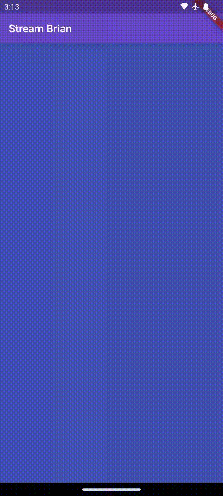

# **Tugas Praktikum Pertemuan 13**

### Nama : Brian Mohamad Safiudin
### NIM : 2141720133
### Kelas : TI-3F

---

# **Praktikum 1: Dart Streams**

## **Soal 1**

- **Tambahkan nama panggilan Anda pada title app sebagai identitas hasil pekerjaan Anda.**

- **Gantilah warna tema aplikasi sesuai kesukaan Anda.**

```Dart
import 'package:flutter/material.dart';

void main() {
  runApp(const MyApp());
}

class MyApp extends StatelessWidget {
  const MyApp({super.key});

  // This widget is the root of your application.
  @override
  Widget build(BuildContext context) {
    return MaterialApp(
        title: 'Stream Brian',
        theme: ThemeData(
            colorScheme: ColorScheme.fromSeed(
                seedColor: Color.fromARGB(255, 119, 92, 217))),
        home: const StreamHomePage());
  }
}

class StreamHomePage extends StatefulWidget {
  const StreamHomePage({super.key});

  @override
  State<StreamHomePage> createState() => _StreamHomePageState();
}

class _StreamHomePageState extends State<StreamHomePage> {
  @override
  Widget build(BuildContext context) {
    return Container();
  }
}
```

---

## **Soal 2**

- **Tambahkan 5 warna lainnya sesuai keinginan Anda pada variabel colors tersebut.**

```Dart
import 'package:flutter/material.dart';

class ColorStream {
  final List<Color> colors = [
    Colors.amber,
    Colors.grey,
    Colors.green,
    Colors.cyan,
    Colors.indigo,
  ];
}
```

---

## **Soal 3**

- **Jelaskan fungsi keyword yield pada kode tersebut!**

- **Apa maksud isi perintah kode tersebut?**

```Dart
import 'package:flutter/material.dart';

class ColorStream {
  final List<Color> colors = [
    Colors.amber,
    Colors.grey,
    Colors.green,
    Colors.cyan,
    Colors.indigo,
  ];

  Stream<Color> getColors() async* {
    yield* Stream.periodic(const Duration(seconds: 1), (int t) {
      int index = t % colors.length;
      return colors[index];
    });
  }
}
```

Keyword `yield*` dalam kode tersebut digunakan untuk menggabungkan nilai dari objek iterable ke dalam stream yang dihasilkan oleh fungsi `getColors`. Pada baris `yield* Stream.periodic(...)`, `yield*` memungkinka nilai-nilai yang dihasilkan oleh objek iterable dari `Stream.periodic` yang berisi daftar warna untuk disertakan secara berurutan ke dalam `stream` utama. Dengan kata lain, setiap detik, `stream` akan menghasilkan warna baru dari daftar warna yang telah ditentukan. 

Pada kode tersebut mendefinisikan class `ColorStream` yang memiliki daftar warna dan sebuah metode `getColors` yang mengembalikan `stream` warna. Class ini menggunakan `Stream.periodic` untuk menghasilkan nilai dengan selang waktu tertentu yaitu setiap detik. Melalui penggunaan `yield`, setiap nilai yang dihasilkan oleh `stream` adalah warna dari daftar warna yang telah ditentukan.

---

## **Soal 4**

- **Capture hasil praktikum Anda berupa GIF dan lampirkan di README.**

</img>
