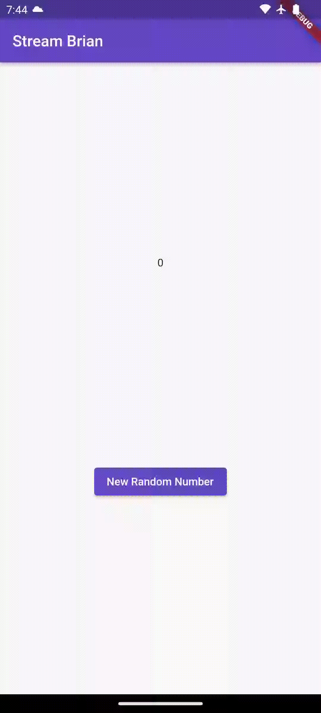
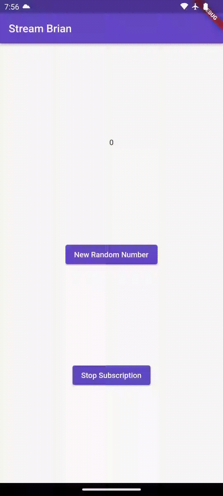
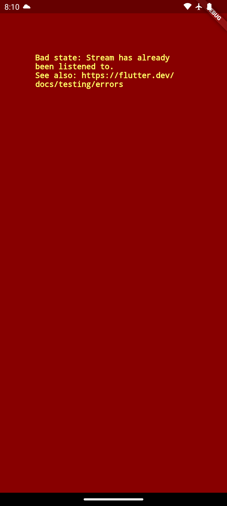

# **Tugas Praktikum Pertemuan 13**

### Nama : Brian Mohamad Safiudin
### NIM : 2141720133
### Kelas : TI-3F

---

# **Praktikum 1: Dart Streams**

## **Soal 1**

- **Tambahkan nama panggilan Anda pada title app sebagai identitas hasil pekerjaan Anda.**

- **Gantilah warna tema aplikasi sesuai kesukaan Anda.**

```Dart
import 'package:flutter/material.dart';

void main() {
  runApp(const MyApp());
}

class MyApp extends StatelessWidget {
  const MyApp({super.key});

  // This widget is the root of your application.
  @override
  Widget build(BuildContext context) {
    return MaterialApp(
        title: 'Stream Brian',
        theme: ThemeData(
            colorScheme: ColorScheme.fromSeed(
                seedColor: Color.fromARGB(255, 119, 92, 217))),
        home: const StreamHomePage());
  }
}

class StreamHomePage extends StatefulWidget {
  const StreamHomePage({super.key});

  @override
  State<StreamHomePage> createState() => _StreamHomePageState();
}

class _StreamHomePageState extends State<StreamHomePage> {
  @override
  Widget build(BuildContext context) {
    return Container();
  }
}
```

---

## **Soal 2**

- **Tambahkan 5 warna lainnya sesuai keinginan Anda pada variabel colors tersebut.**

```Dart
import 'package:flutter/material.dart';

class ColorStream {
  final List<Color> colors = [
    Colors.amber,
    Colors.grey,
    Colors.green,
    Colors.cyan,
    Colors.indigo,
  ];
}
```

---

## **Soal 3**

- **Jelaskan fungsi keyword yield pada kode tersebut!**

- **Apa maksud isi perintah kode tersebut?**

```Dart
import 'package:flutter/material.dart';

class ColorStream {
  final List<Color> colors = [
    Colors.amber,
    Colors.grey,
    Colors.green,
    Colors.cyan,
    Colors.indigo,
  ];

  Stream<Color> getColors() async* {
    yield* Stream.periodic(const Duration(seconds: 1), (int t) {
      int index = t % colors.length;
      return colors[index];
    });
  }
}
```

Keyword `yield*` dalam kode tersebut digunakan untuk menggabungkan nilai dari objek iterable ke dalam stream yang dihasilkan oleh fungsi `getColors`. Pada baris `yield* Stream.periodic(...)`, `yield*` memungkinka nilai-nilai yang dihasilkan oleh objek iterable dari `Stream.periodic` yang berisi daftar warna untuk disertakan secara berurutan ke dalam `stream` utama. Dengan kata lain, setiap detik, `stream` akan menghasilkan warna baru dari daftar warna yang telah ditentukan. 

Pada kode tersebut mendefinisikan class `ColorStream` yang memiliki daftar warna dan sebuah metode `getColors` yang mengembalikan `stream` warna. Class ini menggunakan `Stream.periodic` untuk menghasilkan nilai dengan selang waktu tertentu yaitu setiap detik. Melalui penggunaan `yield`, setiap nilai yang dihasilkan oleh `stream` adalah warna dari daftar warna yang telah ditentukan.

---

## **Soal 4**

- **Capture hasil praktikum Anda berupa GIF dan lampirkan di README.**

</img>

---

## **Soal 5**

- **Jelaskan perbedaan menggunakan listen dan await for (langkah 9) !**

```Dart
void changeColor() async {
  await for (var eventColor in colorStream.getColors()) {
    setState(() {
      bgColor = eventColor;
    });
  }
}
```

`await for` digunakan untuk mengambil nilai dari suatu `Stream` secara sinkron. Ini berarti bahwa blok `setState` tidak akan dieksekusi hingga ada nilai baru yang diterima dari `colorStream.getColors()`. Pemakaian `await for` ini membuat fungsi changeColor bersifat asinkron.

```Dart
  void changeColor() async {
    colorStream.getColors().listen((eventColor) {
      setState(() {
        bgColor = eventColor;
      });
    });
  }
```

Fungsi `listen` akan dipanggil setiap kali ada data baru yang tersedia di `colorStream.getColors()`. Oleh karena itu, blok `setState` akan dieksekusi setiap kali ada perubahan pada `Stream`.

---

# **Praktikum 2: Stream controllers dan sinks**

- StreamControllers akan membuat jembatan antara Stream dan Sink. Stream berisi data secara sekuensial yang dapat diterima oleh subscriber manapun, sedangkan Sink digunakan untuk mengisi (injeksi) data.

- Secara sederhana, StreamControllers merupakan stream management. Ia akan otomatis membuat stream dan sink serta beberapa method untuk melakukan kontrol terhadap event dan fitur-fitur yang ada di dalamnya.

---

## **Soal 6**

- Jelaskan maksud kode langkah 8 dan 10 tersebut!

Pada **langkah 8** tersebut mencakup pengaturan awal untuk mengelola aliran data atau `stream` angka. Pada bagian ini, objek `NumberStream` dibuat dan diinisialisasi, termasuk juga pengambilan controller dari objek tersebut. Controller ini digunakan untuk mengontrol aliran data dan mendapatkan objek `Stream` dari controller, serta menambahkan listener ke aliran data. Dalam hal ini, ketika ada data baru yang diterima di aliran, fungsi yang ditentukan dalam blok `listen` akan dijalankan. Fungsi ini menggunakan `setState` untuk memperbarui state dengan nilai terbaru dari aliram, yang dalam konteks ini disimpan sebagai `lastNumber`.

**Langkah 10** terdiri dari fungsi `addRandomNumber()`, yang bertujuan untuk menambahkan angka acak ke aliran data. Dalam fungsi ini, objek `Random` dibuat untuk menghasilkan angka acak antara 0 dan 9. Angka acak ini kemudian ditambahkan ke `sink` pada objek `NumberStream`. Dengan melakukan hal ini, nilai yang ditambahkan akan dikirimkan ke semua `listener` yang telah didaftarkan ke aliran data tersebut, sehingga memungkinkan tindakan tertentu diambil ketika ada perubahan nilai dalam aliran data.

</img>

---

## **Soal 7**

- Jelaskan maksud kode langkah 13 sampai 15 tersebut!
- Kembalikan kode seperti semula pada Langkah 15, comment addError() agar Anda dapat melanjutkan ke praktikum 3 berikutnya.

Kode pada langkah 13 hingga 15 akan membuat handling ketika terjadi error menggunakan metode `addError()` dalam class `stream.dart`. Dalam konteks ini, jika terjadi error atau kesalahan selama proses iterasi atau saat `stream` menghasilkann ilai, maka fungsi `addError()` dipanggil untuk menangani situasi tersebut. Sebagai hasil dari penanganan kesalahan, nilai variabel dari `lastNumber` akan diatur menjadi -1.

```Dart
  void addRandomNumber() {
    Random random = Random();
    int myNum = random.nextInt(10);
    numberStream.addNumberToSink(myNum);
    // numberStream.addError();
  }
```

---

# **Praktikum 3: Injeksi data ke streams**

- Skenario yang umum dilakukan adalah melakukan manipulasi atau transformasi data stream sebelum sampai pada UI end user. Hal ini sangatlah berguna ketika Anda membutuhkan untuk filter data berdasarkan kondisi tertentu, melakukan validasi data, memodifikasinya, atau melakukan proses lain yang memicu beberapa output baru. Contohnya melakukan konversi angka ke string, membuat sebuah perhitungan, atau menghilangkan data yang berulang terus tampil.

- Pada praktikum 3 ini, Anda akan menggunakan StreamTransformers ke dalam stream untuk melakukan map dan filter data.

---

## **Soal 8**

- Jelaskan maksud kode langkah 1-3 tersebut!

Pada **langkah 1** dilakukan deklarasi variabel `transformer` dengan kata kunci `late`, yang berarti nilai dari variabel ini akan diinisialisasi kemudian. Tipe datanya adalah `StreamTransformer` yang digunakan untuk mengubah `stream` dengan mengaplikasikan transformasi tertentu. Kemudian pada **langkah 2** dilakukan inisialisasi variabel `transformer` dengan menggunakan metode statis `.fromHandlers()` pada `StreamTransformer`. Metode ini menerima 3 fungsi handler yaitu: `handleData` yang dipanggil ketika ada data baru dalam `stream`. Setiap nilai baru dikalikan dengan 10 dan kemudian ditambahkan ke `sink` yang merupakan bagian dari aliran data keluar, `handleError` yang dipanggil ketika terjadi kesalahan dalam `stream`. Jika terjadi kesalahan, -1 akan ditambahkan ke `sink`, `handleDone` yang dipanggil ketika `stream` selesai. Dalam hal ini, `sink` akan ditutup `(sink.close())`. Terakhir, pada **langkah 3** menggunakan `transform` untuk menerapkan `transformer` pada `stream` tertentu. Selanjutnya, memanggil `listen` untuk mendengarkan perubahan pada `stream` yang telah diubah. Ketika `stream` menghasilkan data yang telah diubah, fungsi yang didefinisikan di dalam blok `listen` akan dieksekusi dan data tersebut dapat dimanfaatkan sesuai dengan kebutuhkan pada implementasi selanjutnya.

</img>


---

# **Praktikum 4: Subscribe ke stream events**

- Dari praktikum sebelumnya, Anda telah menggunakan method listen mendapatkan nilai dari stream. Ini akan menghasilkan sebuah Subscription. Subscription berisi method yang dapat digunakan untuk melakukan listen pada suatu event dari stream secara terstruktur.

- Pada praktikum 4 ini, kita akan gunakan Subscription untuk menangani event dan error dengan teknik praktik baik (best practice), dan menutup Subscription tersebut.

---

## **Soal 9**

- Jelaskan maksud kode langkah 2, 6 dan 8 tersebut!

Pada **langkah 2** maksudnya adalah untuk melakukan langganan (subscribe) pada `stream`, sehingga dapat memperoleh informasi atau output yang dihasilkan oleh `stream` tersebut. Kemudian pada **langkah 6** terdapat pemanggilan method `cancel` pada objek `subscription` terhadap `stream`, sehingga `listener` tidak akan menerima pembaruan lebih lanjut dari `stream` tersebut setelah pemanggilan ini. Hal ini dapat berguna saat `widget` dihapus atau tidak lagi memerlukan pembaruan dari `stream` tertentu. Terakhir, pada **langkah 8**, function `addRandomNumber()` akan menghasilkan angka acak antara 0-9 dan kemudian menambahkannya ke `sink` di objek `numberStream`. Namun, sebelum melakukan itu, fungsi memeriksa apakah `sink` telah ditutup. Jika `sink` masih terbuka, random number akan ditambahkan ke dalam stream, jika tidak, nilai `lastNumber` diatur menjadi -1 melalui `setState`. Hal ini untuk mengantisipasi situasi di mana `stream` telah ditutup dan tidak bisa menerima data lebih lanjut.

</img>

---

# **Praktikum 5: Multiple stream subscriptions**

- Secara default, stream hanya bisa digunakan untuk satu subscription. Jika Anda mencoba untuk melakukan subscription yang sama lebih dari satu, maka akan terjadi error. Untuk menangani hal itu, tersedia broadcast stream yang dapat digunakan untuk multiple subscriptions. Pada praktikum ini, Anda akan mencoba untuk melakukan multiple stream subscriptions.

---

## **Soal 10**

- Jelaskan mengapa error itu bisa terjadi ?

Error tersebut terjadi saat mencoba menambahkan atau membuat dua `subscription` pada `stream` yang sama tanpa membatalkan `subscription` sebelumnya. Situasi ini terjadi ketika `subscription2` diinisialisasi dalam metode `initState()`, padahal `subscription` pertama sudah ada untuk menangani `stream` yang sama pada saat yang bersamaan.

</img>
